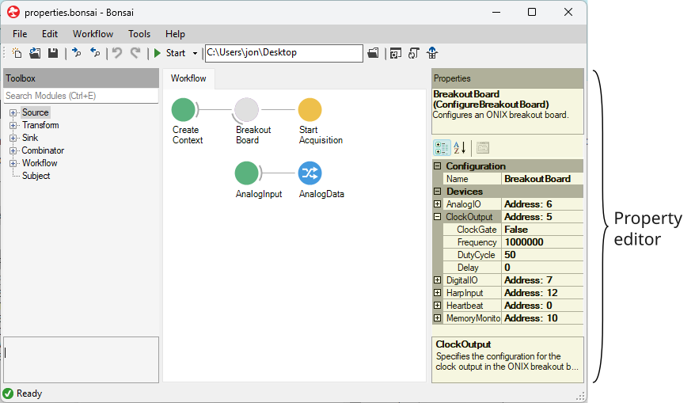

[OpenEphys.Onix1](https://github.com/open-ephys/bonsai-onix1) is a Bonsai
package that exposes a set of Bonsai Operators for control of and data
acquisition from ONIX hardware. This library reference that documents each of
the operators available in the package in a standardized format. This reference
is generated from the [source code](https://github.com/open-ephys/bonsai-onix1).

> [!TIP]
> You can access the reference for a particular operator from within the Bonsai
> editor pressing <kbd>F1</kbd> while an OpenEphys.Onix1 operator is selected in
> the workflow or Toolbox.

## Property Categories
The behavior of Bonsai operators is governed by their "Properties".
Properties can be viewed and changed using Property Editor on the right side of
the workflow:

{width=650px}

Properties in this library fall into several categories which are useful for
distinguishing when a property change will be applied to hardware and the scope
of the property's effect. The following tags are used throughout the
documentation designate these property categories:

### Configuration and Acquisition Properties

| Property Type | Description |
|---------------|-------------|
| Configuration | Configuration properties have an effect on hardware when a workflow is started and are used to initialize the hardware state. If they are changed while a workflow is running, they will not have an effect until the workflow is restarted. For example, CreateContext's <xref:OpenEphys.Onix1.CreateContext.Index> Configuration property is used to specify the hardware prior to starting a recording, and editing this property has no effect until the workflow is started or restarted. |
| Acquisition | Acquisition properties have an immediate effect on hardware when the workflow is running. For example, the <xref:OpenEphys.Onix1.Headstage64ElectricalStimulatorTrigger.InterPulseInterval> property allows dynamically configuring the duration between electrical stimulation pulses. Along with its other Acquisition properties, the entire electrical stimulation pattern can be modulated in real-time while the workflow is running. |

### Device Group and Device Properties

| Property Type | Description |
|---------------|-------------|
| Device Group | Device Group properties are only available through [Device Group configuration operators](xref:configure). They are used to configure a group of devices. For example, ConfigureNeuropixelsV2eHeadstage's <xref:OpenEphys.Onix1.ConfigureHeadstageNeuropixelsV2e.Port> property configures the port name for all devices on the NeuropixelsV2e Headstage (which in turn automatically configures each device's address). |
| Device | Device properties are available through [Device configuration operators](xref:device-configure) and Device Group configuration operators which combine multiple individual device configuration operators. They are used to configure a single device. For example, ConfigureBreakoutBoard's <xref:OpenEphys.Onix1.ConfigureBreakoutBoard.AnalogIO> properties configure the Breakout Board's Analog I/O device. |