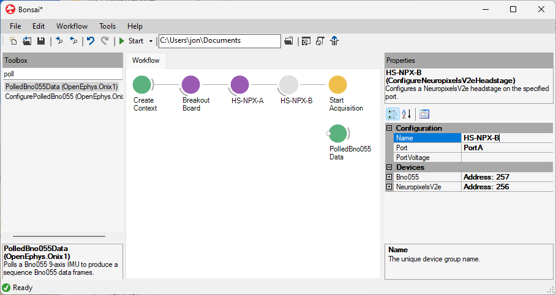
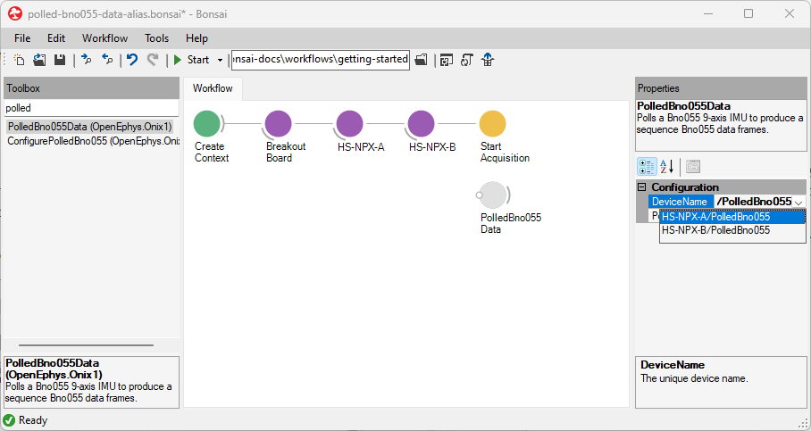
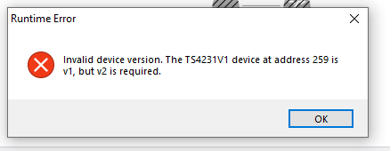

Data flows into a Bonsai workflow from ONIX hardware through [data source
operators](xref:datasource), and back out to the hardware through [data sink
operators](xref:datasink). This section covers how to use them.

## Acquiring Data

Streaming data from ONIX hardware into Bonsai requires at least one [data source
operator](xref:datasource).Place a data source operator and set its DeviceName
property for every device from which you would like to stream. Setting the
DeviceName property will tell the operator from which device to stream data.
This is referred to as linking the data source operator to the device. Take this
workflow for example:

::: workflow

:::

AnalogInput's DeviceName property is set to "BreakoutBoard/AnalogIO" so it will stream data from the
AnalogIO device on the breakout board.

## Use Multiple Instances of Identical Hardware

When using multiple identical headstages or miniscopes, configuration operators
must be given unique `Name` properties so their devices can be distinguished.
When running more than one ONIX system on the same computer, each system's
configuration chain must be assigned a unique `Index`. The following sections
show how to do this.

### Multiple headstages/miniscopes

Linking the data source operator to devices when using two identical headstages
or miniscopes involves an additional step: renaming a configuration operator.
Suppose you want to stream orientation data from two Neuropixels 2.0 Headstages
through using two <xref:OpenEphys.Onix1.PolledBno055Data> operators. By default,
the <xref:OpenEphys.Onix1.ConfigureHeadstageNeuropixelsV2e> operators are both
named "HeadstageNeuropixelsV2e". This causes their devices to also have
identical names, "HeadstageNeuropixelsV2e/PolledBno055". The two headstages and
their devices must be disambiguated. To do this, you must edit one or both of
headstages' `Name` property:

{width=650px}

After this, the disambiguated source can be selected for each data operator

{width=650px}

In the following workflow, the `Name` property of each
<xref:OpenEphys.Onix1.ConfigureHeadstageNeuropixelsV2e> has been changed from
"HeadstageNeuropixelsV2e" to "HS-NPX-A" and "HS-NPX-B". The `DeviceName` of each
of the <xref:OpenEphys.Onix1.PolledBno055Data> operators has been set to
"HS-NPX-A/PolledBno055" and "HS-NPX-B/PolledBno055" from the dropdown so each
operator will take data from a different headstage.

::: workflow

:::

### Multiple ONIX systems

If a second ONIX system is used on the same computer, a second configuration
chain operator is required. In this case, the `Index` property of the
configuration chain that corresponds to the second system should be set to 1. If
three systems are used, they would have `Index` values of 0, 1, and 2. etc.

::: workflow

:::

Now that you can stream data into Bonsai from ONIX hardware, the next step is to
visualize the data.

<!-- ## Minimum Version Check

If you start a workflow and are presented with an exception such as this:

you must revert to a software version
that supports the indicated version of the gateware. -->