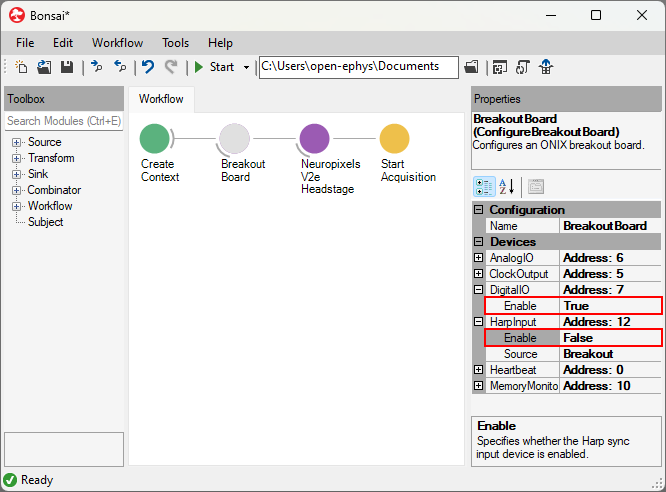
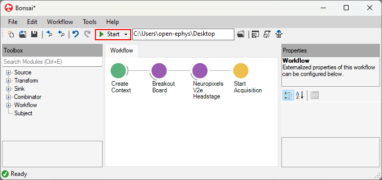

The **Workflow Editor** is a tool for designing and editing Bonsai workflows.
This page describes how to use it.

## Opening the Workflow Editor
To open the workflow editor, either open a previously saved .bonsai file or
start Bonsai and click the **New File** button. Alteratively, you can select a
file from the the list of recently opened files on the right side of the start
up menu.

{width=650px}

This is how the workflow editor looks. There are currently no operators in the workflow.

## Placing Operators into the Workflow

After opening the editor, operators can be selected from the left-side pane to
construct a workflow. There are several ways to find an operator and add it to
the workflow. Because the [CreateContext](xref:OpenEphys.Onix1.CreateContext)
operator is required for every workflow that interfaces with ONIX hardware (as
we'll learn in the next section), let's use it as an example. Here are three
options to place a `CreateContext` operator in the workflow:

1. From the Bonsai editor, navigate to the toolbox on the left side of the screen and expand the
   **Source** section. Next, expand the **OpenEphys.Onix1** section, and find the `CreateContext`
   line. The operator can then be added by either double-clicking it, or dragging and dropping the
   operator into the workflow.

    {width=700px}

2. Click on the textbox at the top of the toolbox on the left, or from Ctrl + E to focus on the
   textbox, and type `CreateContext` to search for the operator. Same as (1), the operator can be
   placed by double-clicking or dragging and dropping; additionally, if the `CreateContext` string
   is highlighted Enter can be pressed to place the operator immediately.

    {width=700px}

3. Hover over the image of the [CreateContext workflow](xref:OpenEphys.Onix1.CreateContext), and
   click on the clipboard icon in the top-right corner of the workflow image to copy the workflow to
   the clipboard. Navigate back to Bonsai, and paste the copied workflow into the active editor.
   Pasting can be done via <kbd>Ctrl + V</kbd>, or right-clicking in the editor and choosing **Paste**.

## Editing Connections

The table below provides information on how to add connections between operators, remove
connections, reordering operators horizontally and vertically, as well as some shortcuts to aid in
placing operators more efficiently.

| Goal | Clicks / Keystrokes | Description |
| ---- | ------------------- | ----------- |
| Connect two operators | Click and hold the first operator, drag the cursor to the second operator, and release | While dragging the cursor, it will temporarily change to a red symbol until there is a valid target (e.g., the second operator), where it will change to an up arrow |
| Connect two operators | Right-click the first operator, and select **Create Connection**. Select the second operator | While moving the cursor, it will change to an up arrow. A valid operator target will change color when hovering over it |
| Connect two operators on placement | Click on an operator in the editor to select it, then place an operator using either method (1) or (2) above | If an operator is currently selected in the editor when a new operator is added, whether it is added by clicking and dragging, double-clicking, or pressing **Enter**, the newly placed operator will be connected to the first operator automatically |
| Disconnect two operators | Click the first operator to select it, hold **Shift**, click and hold the first operator, drag to the second operator, and release | While dragging the cursor, it will temporarily change to a red symbol until there is a valid target (e.g., the second operator), where it will change to an up arrow |
| Disconnect two operators | Right-click the first operator, and select **Remove Connection**. Select the second operator | While moving the cursor, it will change to an up arrow. A valid operator target will change color when hovering over it |
| Move row of operators up | Hold **Alt**, click and hold the first operator, drag upwards to an operator in another row, and release | This action does not require that the operator be selected prior to performing the action. The second operator that is highlighted when the button / mouse are released will now be under the first operator |
| Change order of operators in a row | Hold **Ctrl**, click and hold the first operator, drag to the right to the second operator, and release | This action does not require that the operator be selected prior to performing the action. This can change the order of any two operators that are a part of the same row; it is not constrained to adjacent operators. Note that if the new placement of the operators is not valid (such as giving a `Source` operator an input), it will knock the operator of the current row and remove any connections |

Aside from determining the order of execution, the order of operators within a workflow determines
which editing actions can be taken. In the table below, the "first" operator is always the one that
is on the left side, or on the bottom for multiple rows of operators. If the first operator clicked
is on the right side, or on the top, these actions will not work.

> [!TIP]
> The official Bonsai Documentation contains [a list of commands and
> shortcuts](https://bonsai-rx.org/docs/articles/editor.html#commands-and-shortcuts).

## Editing Operator properties

Each operator can be modified by editing its properties. Properties are edited by
clicking a node in the workflow and changing values in the Properties panel. 

For example, the DigitalIO device will be enabled and the HarpInput device will 
be disabled when the above workflow starts. We'll take a closer look at what this 
workflow does and how it works in the following pages. 

## Accessing Configuration GUIs

Some operators, specifically many of the `Configure*` operators can have a GUI 
(e.g. <xref:np2e_gui>) attached to the operator that allows for easy
manipulation of **Configuration** properties in a graphical environment. These
GUIs can be accessed by double-clicking on an operator when the workflow is not
running. If there is a GUI assigned to it, then it will be opened up in a new,
modal window.

> [!Note]
> Not all operators have GUIs, but if you think that an operator would benefit
> from having this functionality added please reach out to us.

> [!Note]
> GUIs are not part of the base `OpenEphys.Onix1` library. To take advantage of this added
> functionality, you must install the accompanying `OpenEphys.Onix1.Design` library using the Bonsai
> package manager.

A number of Bonsai operators also come with GUIs, but similar to
`OpenEphys.Onix1`, the corresponding `*.Design` library must be installed before
it can be leveraged.

## Accessing the Documentation Browser

The Bonsai Editor includes an embedded **Documentation Browser**. To access
documentation, hover your mouse over an operator and right click. Then, select
**View Help** from the dropdown menu that appears. Alternatively, pressing
<kbd>F1</kbd> will also open the documentation browser. The content that appears
in the help browser depends on what is selected in the workflow editor when the
help browser is opened. For example, without selecting anything, <kbd>F1</kbd>
opens the [official Bonsai docs Workflow Editor
page](https://bonsai-rx.org/docs/articles/editor.html). If a node in the
workflow or a module in the Toolbox is selected, <kbd>F1</kbd> opens
documentation about that operator. 

^^^ 
<video controls style="width:100%">
  <source src="../../images/bonsai-help-panel.webm" type="video/webm">
</video> 
^^^ This video demonstrates how to copy/paste example workflows from Open Ephys's online documentation in Bonsai. Pressing <kbd>Ctrl+E</kbd> focuses the Toolbox and pressing <kbd>F1</kbd> while ConfigureBreakoutBoard is selected in the Toolbox opens the [ConfigureBreakoutBoard page](xref:OpenEphys.Onix1.ConfigureBreakoutBoard) on this website. The example workflow can be navigated to from the ConfigureBreakoutBoard page and copied/pasted into the workflow editor. Yellow circles around the cursor indicate left-clicks; red circles around the cursor indicate right-clicks. 

## Starting the Workflow

Once the desired operators have been placed, connected, and their properties
have been set, you can start the workflow. Note that some aspects of Bonsai are
only available in specific contexts. For instance, the GUIs mentioned above can
only be opened when a workflow is not running. Once a workflow is running, these
GUIs are not accessible, but [visualizers](<xref:visualize-data>) for certain
operators can be opened to view the streaming data.

Running a workflow can be done in one of two ways:

- Press the **Start** button at the top of the Bonsai editor
- Press <kbd>F5</kbd> on your keyboard.

Now that you know the basics of how to make a workflow and navigating the
workflow editor, the next step is to construct and run workflow for ONIX
hardware.