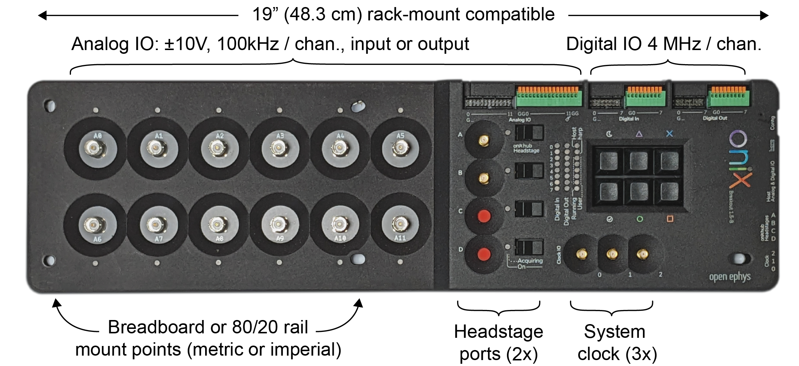

The breakout board acts as the central interface for headstages, miniscopes, and
auxiliary IO to communicate with the computer. It provides the following
features:

- Headstage IO: 2x high-bandwidth, general-purpose headstage communication ports
- [Digital Input](xref:breakout_digital-inputs): 8 bit GPI and button state, 5V
  tolerant, 4 MHz/channel.
- [Digital Output](xref:breakout_digital-outputs): 8 bit of GPO updated at 4 MHz/channel.
- [Analog IO](xref:breakout_analog-io)
  - 12 channels, 100 kHz per channel, independently configurable as input or output.
  - [Input](xref:breakout_analog-io#analog-inputs): independently configurable
   as ±2.5V, ±5V, or ±10V input voltage range.
  - [Output](xref:breakout_analog-io#analog-outputs): fixed ±10V output voltage range.
- [Clock Output](xref:breakout_clock-output): A programmable-frequency clock
  that is hardware-synchronized to acquisition
  - Allows breakout board to drive external hardware acquisition.
  - Note: _disabled by default_.
- [Harp Input](xref:breakout_harp-sync): An input for a
  [Harp](https://harp-tech.org/) behavioral synchronization signal.
- [Heartbeat](xref:breakout_heartbeat)
  - Periodic signal from host with adjustable beat frequency.
- [Memory Monitor](xref:breakout_memory-monitor)
  - Diagnostic device for monitoring hardware first-in, first-out memory use.
  - Used to tune real-time feedback loops for minimal latency.
  - Note: _disabled by default_.

The following pages in the Breakout Board Guide provide an example workflow, a
breakdown of its components, and a Python script for loading data.

> [!TIP]
> Visit the [Breakout Board Hardware
> Guide](https://open-ephys.github.io/onix-docs/Hardware%20Guide/Breakout%20Board/index.html)
> to learn more about the hardware such as the LED indicators and various
> connectors.