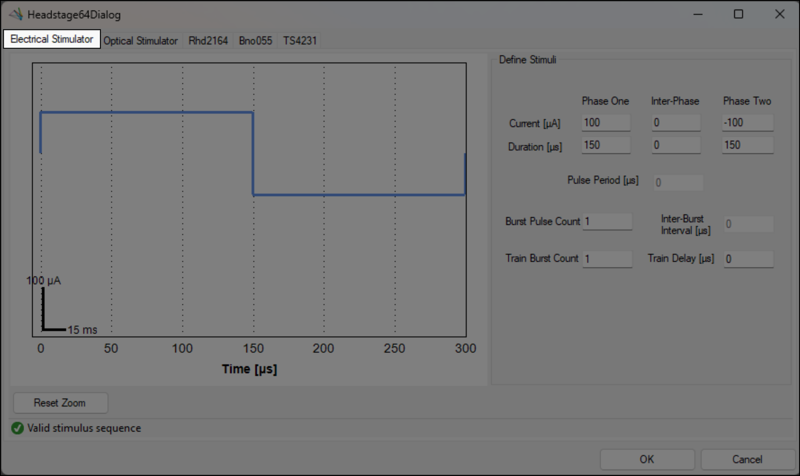

The `Headstage64` headstage has a graphical user interface when the `OpenEphys.Onix1.Design` package is
downloaded. For more information on how to install that library, check out the
<xref:install-configure-bonsai> page.

## Overview

The `Headstage64` GUI allows you to modify settings for all devices on the `Headstage64` headstage
at the same time, such as setting stimulus waveform parameters for optical and electrical
stimulation and simultaneously visualizing the resulting waveform. From the GUI, you can:

- Modify the [ElectricalStimulator](xref:OpenEphys.Onix1.ConfigureHeadstage64ElectricalStimulator)
  waveform parameters.
  - Define the amplitude and duration of the different phases of each pulse.
  - Define the pulse period (time between successive pulses).
  - Define the bursting parameters, such as how many pulses per burst, the time between bursts, and
    how many bursts are applied during each sequence.
- Modify the [OpticalStimulator](xref:OpenEphys.Onix1.ConfigureHeadstage64OpticalStimulator)
  waveform parameters
  - Set the max current for both channels
  - Set the percentage of the max current that each channel outputs
  - Define the pulse duration, period, number of pulses per bursts, and number of bursts per train
- View and modify parameters for all other devices
  - [Rhd2164](xref:OpenEphys.Onix1.ConfigureRhd2164)
  - [Bno055](xref:OpenEphys.Onix1.ConfigureBno055)
  - [TS4231](xref:OpenEphys.Onix1.ConfigureTS4231V1)

### Opening the GUI

This configuration GUI can be accessed by double-clicking on the `ConfigureHeadstage64`
operator when the workflow is not running.

  

### Saving settings

While the GUI is open, you can modify any and all settings on any of the available devices. The
settings will not be saved unless the <kbd>OK</kbd> button is pressed; any other action to exit the
GUI will result in any modifications being discarded. This includes pressing <kbd>Cancel</kbd> or
pressing the Close button in the top right.

Additionally, any changes made in the GUI will not be saved to the Bonsai file unless you save the
file after pressing <kbd>OK</kbd> in the GUI.

## Electrical Stimulator

There are two ways to access the interface for the `ElectricalStimulator` device:

1. Click on the `Electrical Stimulator` tab after opening the headstage GUI (see
   [above](#opening-the-gui)). Note that this is the default tab that is opened first when the
   headstage GUI is opened.

  

2. From the main Bonsai editor, select the `ElectricalStimulator` property from the Devices
   category, and click on the <kbd>...</kbd> button to the right of the name.

  

Whichever method is used to open the interface, the descriptions below will be the same for both.
However, if method 2 is used, the other devices are not available from the same window; the
`ElectricalStimulator` window must be closed so that another device (or the headstage) GUI can be
opened. If any changes are made while the device-specific window is opened that you want to save, be
sure to [save the settings](#saving-settings).

### Interacting with the stimulus waveform

When the interface is first opened, it will display the current settings specified for the device on
the right hand side, and a visual representation of these parameters as a waveform on the left side.
If the default properties are set, the waveform canvas will be blank. To draw a visualization of the
waveform, start inputting parameters on the right until a waveform is fully defined. See
[below](#define-electrical-stimulus-parameters) for more details on how to define the waveform parameters.

Once the waveform is created, you can zoom (mouse wheel, or click-and-drag) and pan (hold the middle
button) to see different parts of the waveform. If the waveform ever goes out of view, or you simply
want to zoom back out to see the whole stimulus waveform, click on the <kbd>Reset Zoom</kbd> button
in the bottom left of the waveform.

When changing parameters, the view of the waveform will remain stationary, meaning that it is
possible for the waveform to disappear from view; clicking the <kbd>Reset Zoom</kbd> button will
place the waveform back into view.

For a quick reference, there is a scale bar that is always displayed in the bottom-left corner of
the waveform visualizer. It will automatically adjust when panning or zoom to remain in the same
location, and the length of each segment corresponds to the amplitude/time axes.

### Define electrical stimulus parameters

The parameters in the `Define Stimuli` box on the right are used to fully define a stimulus waveform
that will be delivered by the `ElectricalStimulator`. The waveform is defined by pulses, bursts, and
trains:
- Each pulse has three components (Phase one, inter-phase, and phase two) with a current and
  duration, plus a period which defines the time between the start of successive pulses.
- Each burst can consist of one or more pulses, with an inter-burst interval defining the
  amount of time to wait between successive bursts.
- Each train can consist of one or more bursts, with a delay from the onset of the stimulus waveform
  before the first train is delivered.

To set the value for each parameter, select the text box and type in the requested value. Values
must represent physically possible stimulation parameters; for example, duration and count cannot be
negative. Invalid values will default to 0.

When setting parameters, using the <kbd>Tab</kbd> key will move the cursor focus to the next
available text box, reading from right-to-left and top-to-bottom.

> [!NOTE]
> Some parameters (pulse period / inter-burst interval) are not modifiable if the burst pulse count
> or train burst count, respectively, are `1`, since those values are undefined.

### Verify electrical stimulus sequence

Towards the bottom of the GUI there is a status bar that will indicate if the current stimulus
sequence is a valid sequence. When it is valid, a green check mark will appear denoting that it is a
valid stimulus sequence.

If there are any issues with the current waveform, it will display a red warning icon, and display a
warning that describes what the current issue is. The text box which is invalid will also be
highlighted in yellow.

## Optical Stimulator

There are two ways to access the interface for the `OpticalStimulator` device:

1. Click on the `Optical Stimulator` tab after opening the headstage GUI (see
   [above](#opening-the-gui)). Note that this is the second tab when the
   headstage GUI is opened.

  

2. From the main Bonsai editor, select the `OpticalStimulator` property from the Devices
   category, and click on the <kbd>...</kbd> button to the right of the name.

  

Whichever method is used to open the interface, the descriptions below will be the same for both.
However, if method 2 is used, the other devices are not available from the same window; the
`OpticalStimulator` window must be closed so that another device (or the headstage) GUI can be
opened. If any changes are made while the device-specific window is opened that you want to save, be
sure to [save the settings](#saving-settings).

Maneuvering along the waveform is the same as the section [above](#interacting-with-the-stimulus-waveform).

### Define optical stimulus parameters

The parameters in the `Define Stimuli` box on the right are used to fully define a stimulus waveform
that will be delivered by the `OpticalStimulator`. The waveform is defined by channels, pulses, bursts, and
trains:
- Each channel can independently control its amplitude as a percentage of a common current value,
  while all remaining parameters are common across both channels.
- Each pulse consists of a channel-specific current and a duration, plus a period which defines the
  time between successive pulses.
- Each burst can consist of one or more pulses, with an inter-burst interval defining the
  amount of time to wait between successive bursts.
- Each train can consist of one or more bursts, with a delay from the onset of the stimulus waveform
  before the first train is delivered.

To set the value for each parameter, select the text box and type in the requested value. Values
cannot be outside of the realm of reality, such as defining a negative duration or a negative count.
Invalid values will default to 0.

When setting parameters, using the <kbd>Tab</kbd> key will move the cursor focus to the next
available text box, reading from right-to-left and top-to-bottom.

> [!NOTE]
> Some parameters (pulse period / inter-burst interval) are not modifiable if the pulses per burst
> or bursts per train, respectively, are `1`, since those values are undefined.

## Verify optical stimulus sequence

Towards the bottom of the GUI there is a status bar that will indicate if the current stimulus
sequence is a valid sequence. When it is valid, a green check mark will appear denoting that it is a
valid stimulus sequence.

If there are any issues with the current waveform, it will display a red warning icon, and display a
warning that describes what the current issue is.

## Rhd2164

While there is not a custom GUI for the `Rhd2164` device, if you navigate to the device tab in the
headstage GUI, you can change settings for the device in the same way you can modify them from the
Bonsai editor itself. For more details on the different properties and parameters for this device,
refer to the [device page](xref:OpenEphys.Onix1.ConfigureRhd2164).

## Bno055

While there is not a custom GUI for the `Bno055` device, if you navigate to the device tab in the
headstage GUI, you can change settings for the device in the same way you can modify them from the
Bonsai editor itself. For more details on the different properties and parameters for this device,
refer to the [device page](xref:OpenEphys.Onix1.ConfigureBno055).

## TS4231

While there is not a custom GUI for the `TS4231` device, if you navigate to the device tab in the
headstage GUI, you can change settings for the device in the same way you can modify them from the
Bonsai editor itself. For more details on the different properties and parameters for this device,
refer to the [device page](xref:OpenEphys.Onix1.ConfigureTS4231V1).
