> [!NOTE]
> The Neuropixels V2e Beta Headstage GUI functions identically to the Neuropixels V2e Headstage. 

The `NeuropixelsV2e` headstage has a graphical user interface when the `OpenEphys.Onix1.Design`
package is downloaded. For more information on how to install that library, check out the
<xref:install-configure-bonsai> page.

## Overview

For `HeadstageNeuropixelsV2e`, the GUI allows for an easy way to change settings and visualize the
effect. From the GUI, you can:

- Configure `Probe A` and `Probe B` independently
    - Change the reference for all electrodes
    - Choose pre-defined channel presets or manually define within a constrained set of possible combinations
    - Choose to invert the polarity of the data
    - Choose the probe type
        - Currently this library supports quad-shank and single-shank 2.0 probes
    - Choose the ProbeInterface configuration file
        - Choose pre-defined channel presets or manually define within a constrained set of possible combinations
        - Easily visualize which electrodes are enabled
- Enable and disable the [Bno055](xref:OpenEphys.Onix1.PolledBno055Data) stream

### Opening the GUI

This configuration GUI can be accessed by double-clicking on the
<xref:OpenEphys.Onix1.ConfigureHeadstageNeuropixelsV2e> operator when the workflow is not running.

  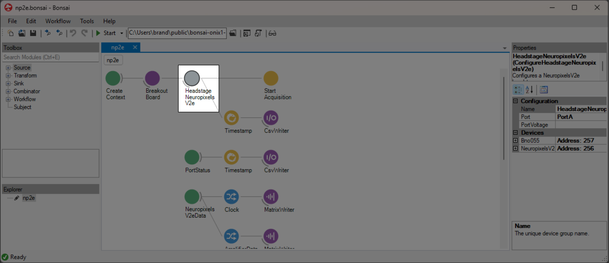

Once opened, if no probe calibration file has been selected the window should look like the image
below. To view the probe, follow the steps [below](#choosing-a-probe-calibration-file).

  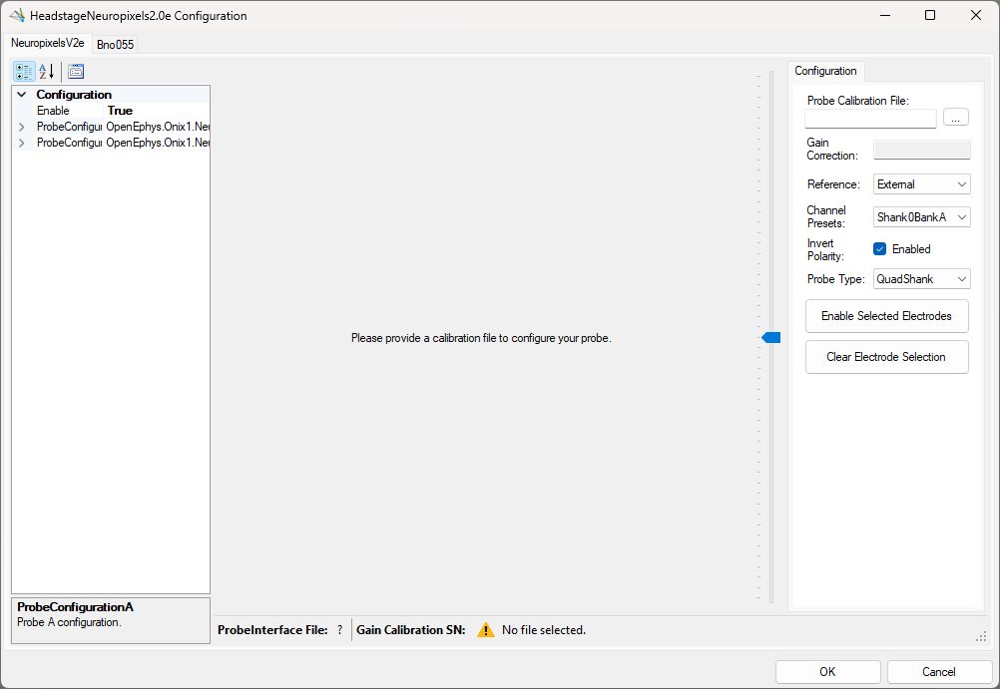

### Channel constraints

For `NeuropixelsV2e`, there will always be 384 channels enabled across the entire probe. Therefore,
when enabling electrodes (either [manually](#manually-enabling-electrodes) or using [channel
presets](#channel-presets)), some previously enabled electrodes will be disabled. Additionally, if
more than 384 electrodes are manually selected to be enabled, only the last 384 channels will end up
being enabled. It is therefore recommended to always double-check that the correct electrodes are
enabled. 

As an example, let us assume that electrodes `0` through `383` are initially enabled (this
corresponds to 384 channels). Then, electrodes `384` and `385` are enabled. When these electrodes
are enabled, electrodes `0` and `1` will be disabled. In this way, there will always be 384 channels
enabled.

In addition to the absolute number of channels, there are other restrictions in place regarding
which combinations of electrodes can be enabled at any given time. Specifically, in the
<xref:OpenEphys.Onix1.NeuropixelsV2Electrode> there is a `Channel` property which defines
the channel index of an electrode. Across the entire probe, no two electrodes that share the same
`Channel` can be simultaneously enabled. 

[Channel presets](#channel-presets) take this into account automatically and ensure that the rules
are followed. When manually enabling electrodes, the indexing logic is applied in the order that
electrodes are selected. If two (or more) electrodes are selected that share a `Channel` value, the
highest indexed electrode is the only one that will be enabled.

> [!NOTE]
> Due to these constraints, some combinations of electrodes are not possible.

### Keeping or discarding configuration settings

While the GUI is open, configuration settings can be freely modified and will not affect the
configuration unless <kbd>OK</kbd> is pressed. This includes all aspects of the configuration, such
as the probe type, which electrodes are enabled, the chosen reference channel, and the probe
calibration file. However, the electrode configuration as described below can be saved independently
of the other configuration settings.

> [!NOTE]
> The hardware is not actually configured until the workflow starts.

If the window is closed any other way (such as by pressing `Cancel`, or pressing the <kbd>X</kbd> to
close the window), then any configuration changes made *will not* be saved.

### ProbeInterface

The `HeadstageNeuropixelsV2e` GUI uses
[ProbeInterface](https://probeinterface.readthedocs.io/en/main/index.html) as the format to save and
draw the probes and electrodes visually. For more information on ProbeInterface and the resulting
JSON file, check out their [format
specifications](https://probeinterface.readthedocs.io/en/main/format_spec.html) page. 

When opening the GUI, there is a default probe configuration that is loaded and drawn, which can be
saved to a [JSON file](#save-probeinterface-file). Conversely, an existing JSON file can be
[loaded](#load-probeinterface-file) to update the current channel configuration. If for any reason
the default configuration is needed, it can be [loaded again](#load-default-configuration) at any
time.

## Neuropixels V2 Probe Configuration

There are two ways to access the interface for each Neuropixels V2 probe:

1. Click on the `ProbeConfiguration[A|B]` property on the left after opening the headstage GUI (see
   [above](#opening-the-gui)). Note that this is the default property selected when the
   headstage GUI is opened. To view the electrode configuration of the other probe, click on the
   `ProbeConfiguration` property and the view of the electrodes in the middle will update.

  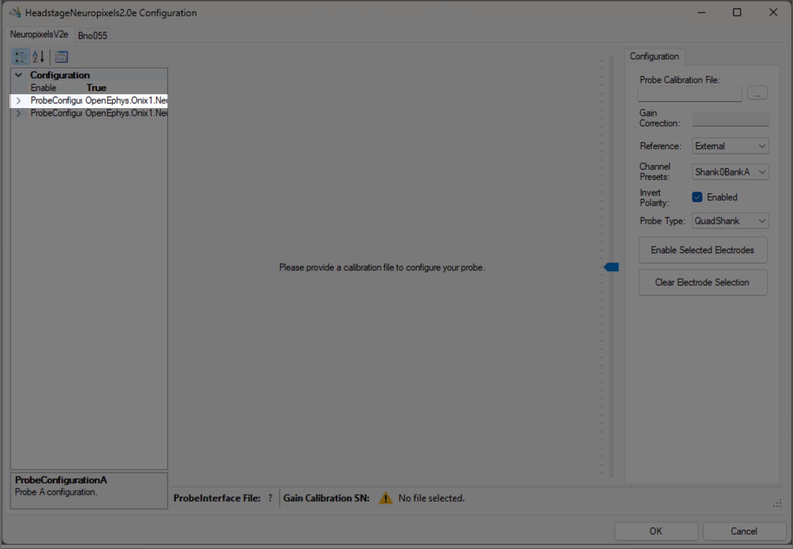

2. From the main Bonsai editor, select the `ProbeConfigurationA` property from the Devices
   category, and click on the <kbd>...</kbd> button to the right of the name.

  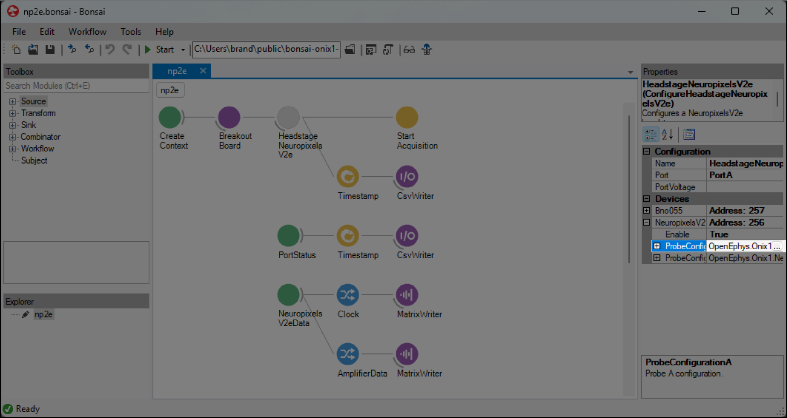

Whichever method is used to open the GUI, the descriptions below will be the same for both.
However, if method 2 is used, other devices are not available from the same window; the
`Probe Configuration` window must be closed so that another device (or the headstage) GUI can be
opened. If any changes are made while the device-specific window is opened that you want to save, be
sure to [save the settings](#keeping-or-discarding-configuration-settings).

### Choosing a probe calibration file

Upon opening the GUI for the first time, if no probe calibration file was set in the Bonsai editor,
the window will be mostly blank. To populate the window with a drawing of the probe, click on the
ellipsis button to the right of the empty text box under "Probe Calibration File:" (see below). This
will open a file dialog, where the calibration file can be searched for and selected. 

  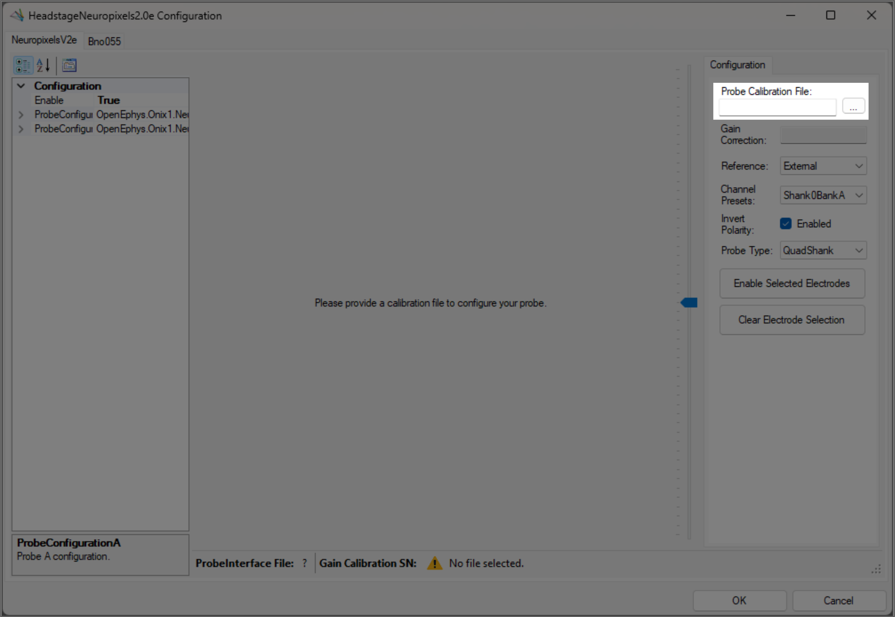

> [!NOTE]
> Files are expected to be named `XXXXXXXXXXX_gainCalValues.csv`, where "XXXXXXXXXXX" is the probe serial number.

Once the file is selected, press `Open` or <kbd>Enter</kbd>. This will populate the text box with
the filepath to the calibration file and enable visualization of the electrodes. Below is a view of
the Probe Configuration GUI that has been opened for `Probe A` with a gain calibration file
selected. Note that the `Gain Correction` textbox and the `Gain Calibration SN: ` status strip are
automatically filled in with values found in the calibration file.

  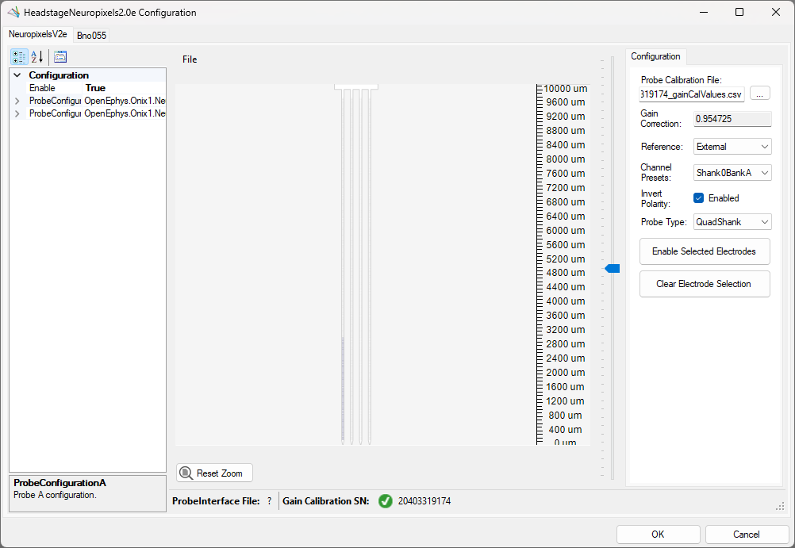

### Selecting channel reference

Underneath the probe calibration filepath, there is a dropdown menu for choosing the reference for
all channels. For possible values and a brief description of what they correspond to, check out the
reference page for 
[quad-shank](xref:OpenEphys.Onix1.NeuropixelsV2QuadShankReference) and
[single-shank](xref:OpenEphys.Onix1.NeuropixelsV2SingleShankReference) probes.

  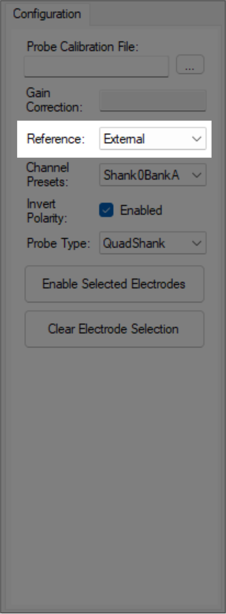

### Channel presets

To save time, it is possible to select a preset channel combination from the `Channel Presets`
dropdown. These presets are defined to work within the constraints of `NeuropixelsV2e` channel
combinations defined [above](#channel-constraints).

If electrodes are manually enabled, the `Channel Presets` dropdown will change to **None**,
indicating that a channel preset is no longer selected.

  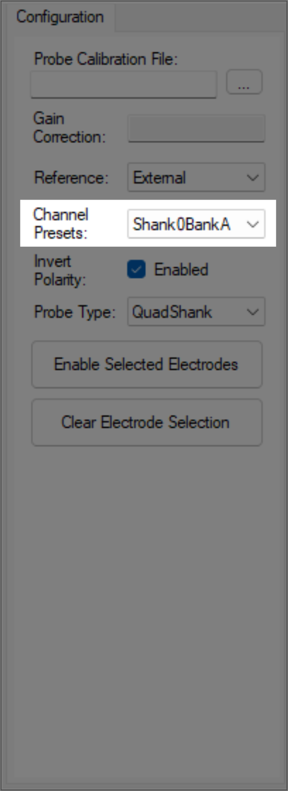

#### Quad-shank probe presets:
- Shank N Bank [A | B | C | D]
    - Enables all electrodes in the chosen bank on shank N
    - To learn more about the banks along each shank, check out the <xref:OpenEphys.Onix1.NeuropixelsV2Bank> page.
- All Shanks N_M
    - Enables all electrodes starting at shank index N up to shank index M across all four shanks

#### Single-shank probe presets:
- Bank [A | B | C | D]

### Inverting the polarity of ephys data

A checkbox indicates whether the ephys data will be inverted or not. This option is enabled by
default, as Neuropixels hardware inverts neural data; therefore, leaving this option enabled will invert
the data again, matching the data recorded by the Open Ephys GUI or other hardware sources.

  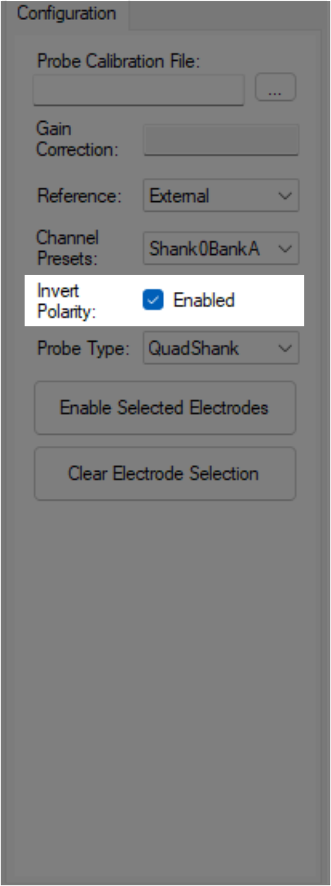

### Selecting probe type

A dropdown menu allows you choose between a
[quad-shank](xref:OpenEphys.Onix1.NeuropixelsV2QuadShankProbeConfiguration) probe, and a
[single-shank](xref:OpenEphys.Onix1.NeuropixelsV2SingleShankProbeConfiguration) probe. 

  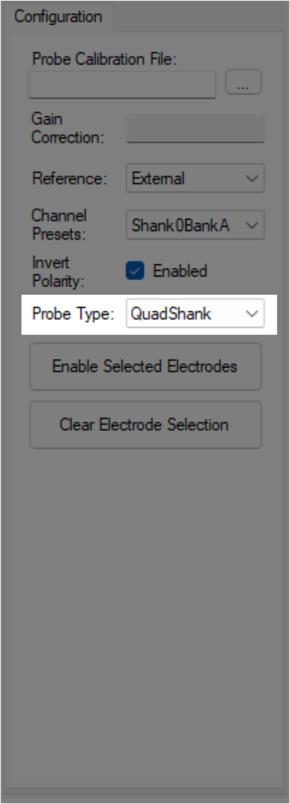

> [!NOTE]
> Switching to a new probe type will reset the calibration file, reference, electrode selection, and
> invert polarity option. The selections are not discarded immediately, and can be retrieved by
> selecting the previous probe type. However, if the probe type is changed, and then the GUI is closed
> by pressing <kbd>OK</kbd>, all previous probe group settings will be lost.

### Maneuvering along the probe

Once a GUI has been [opened](#opening-the-gui) and a probe calibration file has been
[selected](#choosing-a-probe-calibration-file), the main panel on the left will be populated with a
`NeuropixelsV2e` probe. Below are the buttons used to navigate within this panel to view and choose
electrodes.

- Mouse Controls
    - Mouse wheel zooms in/out towards the cursor
    - Left-click and drag will select electrodes within the drawn rectangle
    - Left-click on an electrode will select that electrode
    - Left-click in empty space will clear the selected electrodes
    - Middle-click and drag will pan the electrodes
- Scroll bar
    - On the right side of the main panel there is a scroll bar that can be used to move the probe up and down
    - Panning the probe up or down will update the scroll bar once the movement has completed
    - The scroll bar can be moved by:
        - Grabbing the marker using the mouse and dragging it up or down
        - Placing the cursor either above or below the marker and clicking
        - Using the mouse wheel to scroll up or down while the cursor is over the scroll bar

### Reset zoom

When zooming in and out, there are limits in both directions. The probe can only be zoomed out to
the point that the entire probe is visible within the panel, and similarly the probe will not zoom
in past a certain point. 

There are no restrictions when panning the probe, meaning that it is possible to move the probe to
where it is out of view, and difficult to find. To reset the view at any time, click on the `Reset
Zoom` button to fully zoom out the panel.

  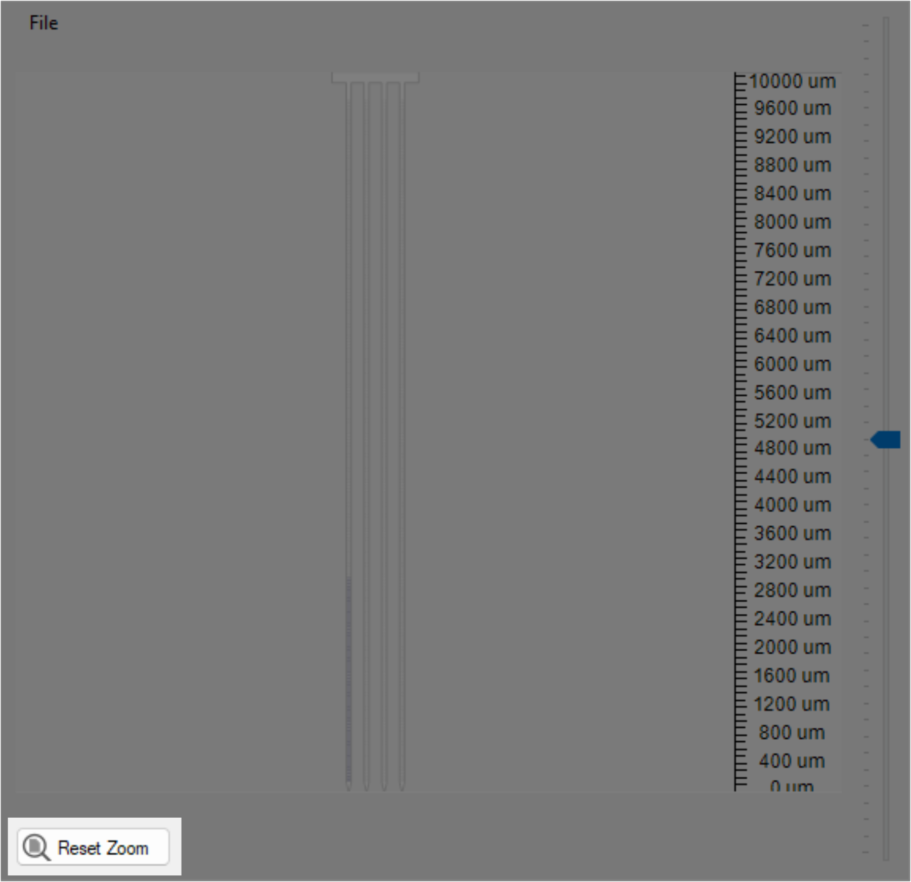

### Manually enabling electrodes

Electrodes can be selected at any zoom level, but it is often preferable to zoom in to read the
electrode indices. Consider maximizing the screen to see those numbers more easily.

To select, as described [above](#maneuvering-along-the-probe), either click-and-drag the cursor over
the desired electrodes, or select individual electrodes by clicking on them one-by-one. Once the
electrodes to enable are selected, click on the `Enable Selected Electrodes` button in the right
panel. At this point the selected electrodes should turn blue, indicating that they are now enabled.
It is important to note that when electrodes are enabled, a number of previously enabled electrodes
will be disabled due to channel constraints. For more information, read the [Channel
constraints](#channel-constraints) section above.

The short video below shows how to select, clear selection, enable selected electrodes, and
translate using the scroll bar. Note that once electrodes are manually enabled, the `Channel
Presets` drop-down changes to `None`. Then, once the selected electrodes match the preset, it is
automatically changed back to `Shank0BankA`.

  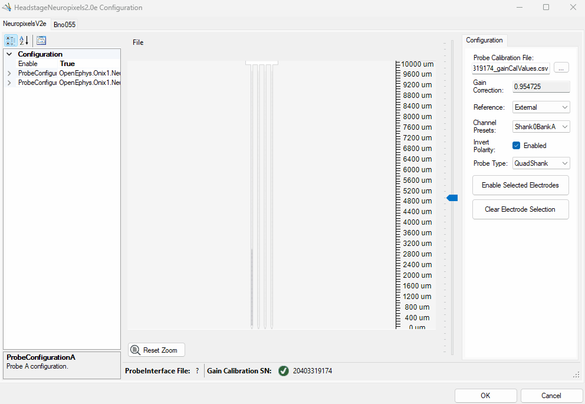

 

## Loading and saving channel configurations

When the GUI is first opened and after a probe calibration file has been specified, the default
[ProbeInterface](#probeinterface) configuration is loaded and drawn in the main panel. In this case,
the default configuration is for a quad-shank `Neuropixels 2.0` probe, with the `Shank0BankA` channel
preset selected. To load a new configuration, load the default configuration, or save the current
configuration, go to the File drop-down menu (see below) and choose the relevant option.

  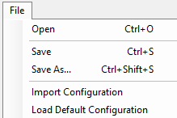

### Load ProbeInterface file

To open a file, navigate to the file menu option `File → Open` or press <kbd>Ctrl + O</kbd>. This
will open a file dialog window; browse to the existing JSON file, select it and press `Open` to view
 the channel configuration. The new probe will be loaded and drawn, with the enabled electrodes
highlighted.

The `ProbeInterface File` section of the status bar will update to display the filename that was
selected. To view the entire filepath for the file, hover over the filename to display a tooltip
with the entire filepath.

### Save ProbeInterface file

Whenever changes are made to the ProbeInterface configuration, an asterisk will appear on the tab or
title of the window to indicate that some changes to the electrode configuration are unsaved. To
save the file, go to the file menu option `File → Save` or press <kbd>Ctrl + S</kbd>. 

- If there is not a filename already selected, this will open a file dialog window to save a new
  file. Choose a folder location and a name for the file, then hit `Save`.
- If a filename is already selected, then the file will be immediately saved to the current
  filepath, overwriting the channel configuration.
  - If you do not want to overwrite the channel configuration, you can instead use `File → Save As`
    or <kbd>Ctrl + Shift + S</kbd> to save the current electrode configuration to a new filepath.

If there are unsaved changes to the electrode configuration, pressing <kbd>Cancel</kbd> will discard
all unsaved changes. If the electrode configuration is first saved to a file, and then
<kbd>Cancel</kbd> is pressed, the changes are still saved in the file; however, other probe
configuration properties such as the ProbeInterface file name or the reference used, will be
discarded. When <kbd>OK</kbd> is pressed and there are unsaved changes, a prompt will appear
confirming if you would like to save, save as, or cancel closing the dialog.

### Import configuration

Instead of opening a file and updating the ProbeInterface filename, you can instead choose to import
another configuration by going to `File → Import Configuration`. This will open up a Load File
dialog, where you can select an existing ProbeInterface file that will be imported without modifying
the current filename.

### Load default configuration

To load the default channel configuration at any time, navigate to the drop-down menu and choose
`File → Load Default Configuration`. This will load the default configuration, with the
`Shank0BankA` channel preset selected.

## Configure Bno055

At the headstage level, there is another device tab listed for a
[Bno055](xref:OpenEphys.Onix1.PolledBno055Data). From this tab, the device can be enabled or
disabled by selecting the appropriate value from the drop-down menu next to `Enable`. While the
`DeviceAddress` and `DeviceName` values are modifiable here, they have no affect on the underlying
device configuration; only changes to the `Enable` property will be respected.

  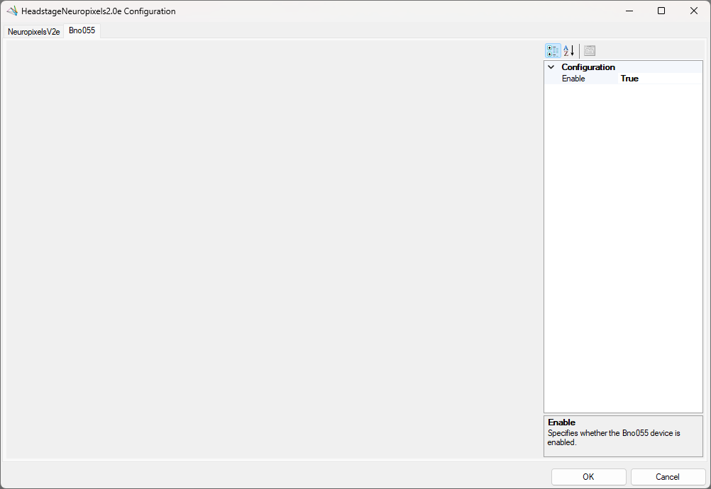

