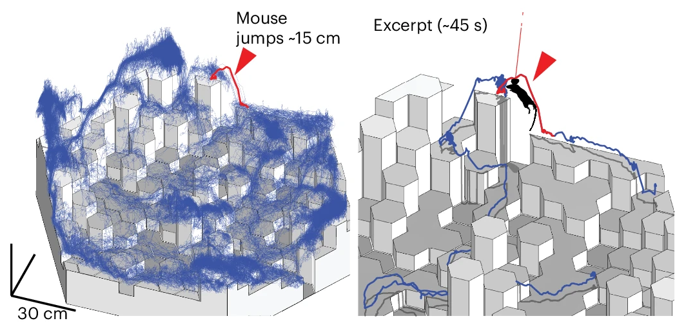
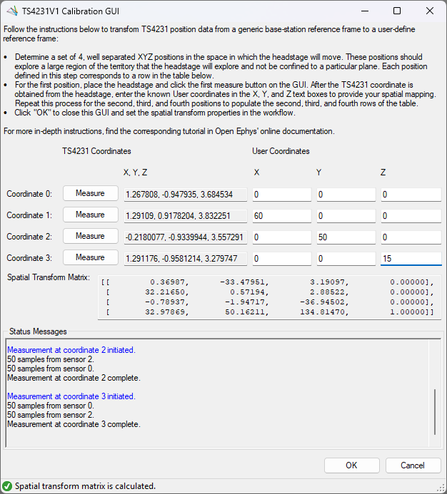

This tutorial shows how to transform XYZ position coordinates measured by a TS4231 device which are
originally in the device's reference frame to coordinates that are in a reference frame that is more
intuitive or relevant to the experiment. This is performed by determining the position coordinates
of four points in both the TS4231 device's reference frame and the user-defined reference frame. to
calculate a spatial transform matrix which transforms all coordinates measured by the TS4231 to the
user-defined coordinate system.

^^^

^^^ From figure 3 of [ONIX: a unified open-source platform for multimodal neural recording and perturbation during naturalistic behavior](https://www.nature.com/articles/s41592-024-02521-1), the TS4231 device was used to track a mouse's 3D position over the course of a 7.3-h-long recording.

## Prerequisites

1.  First, confirm the Lighthouse transmitters are properly mounted according to the [Lighthouse
    Setup Guide](https://open-ephys.github.io/onix-docs/Hardware%20Guide/Lighthouses/setup.html) in
    the ONIX Hardware docs.

1.  Follow the [Getting Started](xref:getting-started) guide to set up and familiarize yourself with
    Bonsai. In particular, [download the necessary Bonsai
    packages](xref:install-configure-bonsai#package-installation) or [check for
    updates](xref:install-configure-bonsai#update-packages) if they're already installed. 

1.  Copy the following workflow into the Bonsai workflow editor by hovering over
    workflow image and clicking on the clipboard icon that appears.

    ::: workflow
    
    :::

    Open Bonsai and paste this workflow by clicking the Bonsai workflow editor pane and hitting
    <kbd>Ctrl+V</kbd>.

    Visit the <xref:hs64_workflow> and <xref:hs64_ts4231> pages to develop a foundation on how to
    use Bonsai to acquire data from an Onix headstage that has a TS4231 device. The primary
    difference between this workflow and the example Headstage 64 workflow is that there is
    transform operator for converting coordinates in the TS4231V1 reference frame to a user defined
    reference frame.

1.  Before beginning the calibration process, confirm that the lighthouse configuration can measure
    the position of your TS4231 device across the entire desired range. To do this, [start the
    workflow](xref:workflow-editor#starting-the-workflow) and confirm that the
    <xref:OpenEphys.Onix1.TS4231V1PositionData> operator continually produces data as you slowly
    move the headstage across the entire range of your arena while inspecting the
    TS4231V1PositionData Position [visualizer](xref:visualize-data). If at some point the
    TS4231V1PositionData operator stops producing data during this process (e.g. the Position
    visualizer stops updating), the TS4231 receivers are either obstructed from or no longer within
    range of the Lighthouse base station transmitters. Remedying this might require modifying the
    lighthouse configuration or reducing the size of your arena.

## TS4231 Spatial Data Calibration

1.  open the TS4231V1 Position Calibration GUI. 

    -   Start the workflow. 
    -   Open the <xref:OpenEphys.Onix1.TS4231V1SpatialTransform> Position visualizer.
    -   Click TS4231V1SpatialTransform node to show its properties in the properties panel.
    -   Click the <kbd>...</kbd> next to the "SpatialTransform" property.

    

1.  Mark four points in your behavioral arena. The position coordinates of these four points will be
    measured both in the TS4231 reference frame by the TS4231 device itself and in the user-defined
    reference frame (if they are not already known, for example, using some features in the behavioral
    arena with known dimensions). Here is a simple way to choose the four coordinates:

    1.  the user-defined origin
    2.  a point in the behavioral arena along the user-defined X-axis
    3.  a point in the behavioral arena along the user-defined Y-axis
    4.  a point in the behavioral arena along the user-defined Z-axis

    > [!TIP]
    > Choosing the furthest extent along the X, Y, & Z axes minimizes the propagation of measurement
    > error into the spatial transformation matrix. Balance this consideration with ease of knowing
    > or measuring those coordinates.

    Here is a real-world example of four coordinates on our workbench that we use to
    demonstrate the calibration process:

    {width=75%}

    The light red space is an arbitrarily-defined working area for this demo.
    Units are in cm.

1.  For each of the four points defined in the previous step:

    -   Choose a row in the TS4231V1 Calibration GUI to correspond to that point. 
    
    -   Place your TS4231 device at that point and click the <kbd>Measure</kbd> button in the
        corresponding row. The GUI will start taking measurements from the TS4231 device as long as
        the TS4231 device is within range of and unobstructed from the lighthouse transmitter. If
        the TS4231 measurement completes successfully, the corresponding entry in form is
        automatically populated. Otherwise, that entry stays empty. In either case, you will be
        informed in the "Status Messages" text box. If the TS4231 measurement fails, you may have to
        reorient your Headstage64 or go back to the step in the previous section that describes how
        to make sure the lighthouse configuration covers the entire area that your TS4231 device
        will occupy.

    -   Populate the X, Y, and Z entries of the user-defined coordinates column in the corresponding
        row.

    > [!TIP]
    > Be as precise and accurate as possible with both the placement of the TS4231 device and the
    > manual measurements when performing this calibration step. Consider making a fixture to fix
    > the orientation of the TS4231 device and help set it in positions that are more easily
    > measured or easier to figure out using features in the behavioral arena that have known
    > dimensions.

    Once all fields in the Calibration GUI are populated with valid entries, the spatial transform
    matrix is automatically calculated. When the spatial transform matrix is calculated, this will
    be indicated in the GUI's bottom status strip and the spatial transform matrix text box such as
    in the following screenshot: 
    
    

1.  When spatial transform is calculated, click OK to proceed. This updates the spatial transform
    matrix used by the TS4231V1SpatialTransform operator. This recalibrated spatial transform matrix
    should be immediately apparent in the TS4231V1SpatialTransform position data visualizer.
    
    If you are presented with the following confirmation, return to the TS4231 Calibration GUI main
    form to fix the entries that were indicated invalid in the confirmation dialog.
    
    

> [!IMPORTANT]
> After calibration the TS4231V1 spatial transform matrix, it is important to not change the
> TS4231PositionData operator's P/Q property values or move the lighthouse base stations or else
> the calibrated spatial transform matrix will no longer be accurate. 

## Verify TS4231 Calibration

After following one of the two methods in the previous section, [visualize](xref:visualize-data) the
calibrated data and confirm that the transformed data matches your expectations. Inspecting the
Position visualizer in Bonsai while moving the TS4231 device is a first-order test. To be more
robust, choose a bunch of points (none of which should be the four calibration points) and check
that their calibrated coordinates are what you expect.

Below is a animation of the 3D trajectory reconstructed in Python synced with video data for
demonstration purposes. 

<video controls style="width:100%">
  <source src="../../images/tutorials/calibrate-ts4231/ts4231-calibration-demo.mp4" type="video/mp4">
</video>

