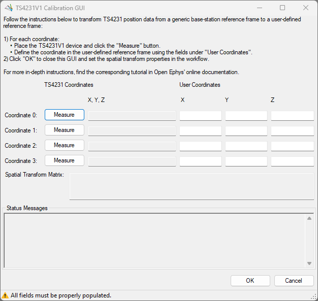
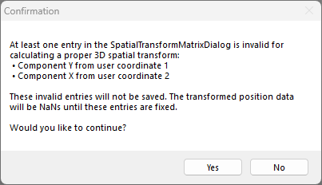

This tutorial shows how to transform position coordinates as measured by the TS4231 and convert them
into user-defined coordinates that are more intuitive or relevant to the experiment. This is
performed by taking four points and determining their position coordinates in both reference frames.
These two sets of position coordinates can be used to calculate a spatial transform matrix which can
transform all coordinates measured by the TS4231 thereafter to the user-defined coordinate system.

## Prerequisites

1.  First, confirm the Lighthouse transmitters are properly mounted according to the [Light House
    Setup Guide](https://open-ephys.github.io/onix-docs/Hardware%20Guide/Lighthouses/setup.html) in
    the ONIX Hardware docs.

1.  Follow the [Getting Started](xref:getting-started) guide to set up and familiarize yourself with
    Bonsai. In particular, [download the necessary Bonsai
    packages](xref:install-configure-bonsai#package-installation) or [check for
    updates](xref:install-configure-bonsai#update-packages) if they're already installed. 

1.  Copy the following workflow into the Bonsai workflow editor by hovering over
    workflow image and clicking on the clipboard icon that appears.

    ::: workflow
    
    :::

    Open Bonsai and paste this workflow by clicking the Bonsai workflow editor pane and hitting
    <kbd>Ctrl+V</kbd>.

    > [!TIP]
    > Visit the <xref:hs64_workflow> and <xref:hs64_ts4231> pages to develop a foundation on how to
    > use Bonsai to acquire data from an Onix headstage that has a TS4231 device.

1.  Typically, you will want to be able to measure position across the entire XYZ range of your
    behavioral arena. To do this, [start the workflow](xref:workflow-editor#starting-the-workflow)
    and confirm that the <xref:OpenEphys.Onix1.TS4231V1PositionData> operator continually produces
    data as you slowly move the headstage across the entire range of your arena while inspecting the
    TS4231V1PositionData position data [visualizer](xref:visualize-data). If at some point the
    TS4231V1PositionData operator stops producing data during this process (e.g. the Position
    visualizer stops updating), the TS4231 receivers are either obstructed from or no longer within
    range of the Lighthouse base station transmitters. Remedying this might require modifying the
    experimental setup.

## TS4231 Spatial Data Calibration

1.  Mark four points in your behavioral arena. The position coordinates of these four points will be
    measured both in the TS4231 reference frame by the TS4231 device itself and will be measured in
    the user-defined reference frame if they are not already known a priori using some features in the
    behavioral arena with known dimensions. Here is an example set of four points that the user
    might want to use:

    1.  the user-defined origin
    2.  a point in the behavioral arena along the user-defined X-axis
    3.  a point in the behavioral arena along the user-defined Y-axis
    4.  a point in the behavioral arena along the user-defined Z-axis

    > [!NOTE]
    > Choosing the furthest extent along the X, Y, & Z axes minimizes the propagation of measurement
    > error into the spatial transformation matrix. Balance this consideration with ease of knowing
    > or measuring those coordinates.

1.  While the workflow is running: 

    - double-click the Position node connected to the
      <xref:OpenEphys.Onix1.TS4231V1SpatialTransform> node to open the position data visualizer
      connected to TS4231V1SpatialTransform
    - click TS4231V1SpatialTransform node to makes its properties appear in the properties panel
    - click the <kbd>...</kbd> next to the "SpatialTransform" property to open the TS4231 Position
      Calibration GUI. 

    

    > [!TIP]
    > Visit the TS4231 Calibration GUI Calibration page to learn the details of this GUI.
    
1.  For each of the aforementioned four points:
    
    -   Place the Headstage 64 at that point and click the <kbd>Measure</kbd> button on the
        left-side of the TS4231 Calibration GUI that corresponds to the point you're
        measuring. This will start measurement of the XYZ coordinates by the TS4231 device in the
        TS4231 coordinate system as long as the TS4231 device is within range of and unobstructed
        from the lighthouse base station transmitter. If the TS4231 measurement completes
        successfully, the corresponding entry in form is automatically populated. Otherwise, that
        entry stays empty.

    -   Populate the X, Y, and Z component entries of the user-defined coordinates on the right-side
        of the TS4231 Calibration GUI. This can be performed in tandem with the TS4231 device 
        measurements. 

    The image below shows a screenshot with these two bullet points performed 

1.  Once all fields in the Calibration GUI are populated with valid entries, the spatial transform
    matrix is automatically calculated. When the spatial transform matrix is calculated, this will
    be indicated in the GUI's bottom status strip and the spatial transform matrix text box such as
    in the following screenshot: 
    
    

    When this occurs, click OK to proceed. This updates the spatial transform matrix used by the
    TS4231V1SpatialTransform operator. After clicking OK, this recalibrated spatial transform matrix should be
    immediately apparent in the TS4231V1SpatialTransform position data visualizer, more prominently
    so if the spatial transform matrix was previously uncalibrated.
    
    If a confirmation dialog appears when OK is clicked such as in the following
    screenshot:
    
    

    return to the TS4231 Calibration GUI main form to fix the entries that were indicated invalid in
    the confirmation dialog.

> [!IMPORTANT]
> After calibration the TS4231V1 spatial transform matrix, it is important to not change the
> TS4231PositionData operator's P/Q property values or move the light house base stations or else
> the calibrated spatial transform matrix will no longer be accurate. 

## Verify TS4231 Calibration

After following one of the two methods in the previous section, [visualize](xref:visualize-data) the
calibrated data and confirm that the transformed data matches your expectations.