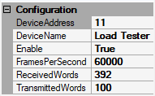
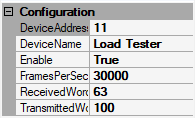
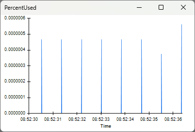

This tutorial shows how to retrieve data from the ONIX hardware as quickly as
possible for experiments with strict low-latency closed-loop requirements by
tuning the workflow for your particular data sources and computer
specifications. In most situations, sub-200 microsecond closed-loop response
times can be achieved.

> [!NOTE]
> Performance will vary based on your computer's capabilities and your results
> might differ from those presented below. The computer used to create this
> tutorial has the following specs:
>
> - CPU: Intel i9-12900K
> - RAM: 64 GB
> - GPU: NVIDIA GTX 1070 8GB
> - OS: Windows 11

## Data Transmission from ONIX Hardware to Host Computer

ONIX is capable of transferring data directly from production to the
host computer. However, if the host is busy when ONIX starts
producing data, ONIX will temporarily store this new data in its hardware buffer
while it waits for the host to be ready to accept new data. 

Key details about this process:

-   The size of hardware-to-host data transfers is determined by the
    <xref:OpenEphys.Onix1.StartAcquisition.ReadSize> property of the
    <xref:OpenEphys.Onix1.StartAcquisition> operator which is in every Bonsai
    workflow that uses <xref:OpenEphys.Onix1> to acquire data from ONIX.
-   Increasing `ReadSize` allows the host to read larger chunks of data from
    ONIX per read operation without significantly increasing the duration of the
    read operation, therefore increasing the maximum rate at which data can be
    read.
-   If the host is busy or cannot perform read operations rapidly enough to keep
    up with the rate at which ONIX produces data, the ONIX hardware buffer will
    start to accumulate excessive data. 
-   Accumulation of excess data in the hardware buffer collapses real-time
    performance and risks hardware buffer overflow which would prematurely
    terminate the acquisition session. `ReadSize` can be increased to avoid this
    situation.
-   As long as this situation is avoided, decreasing `ReadSize` means that ONIX
    doesn't need to produce as much data before the host can access it. This,
    in effect, means software can start operating on data closer to the time
    that the data was produced, thus achieving lower-latency feedback-loops.

In other words, a small `ReadSize` can help the host access data sooner to when
that data was created. However, each data transfer incurs overhead. If
`ReadSize` is so small that ONIX produces a `ReadSize` amount of data faster
than the average time it takes the host computer to perform a read operation,
the hardware buffer will accumulate excessive data. This will destroy real-time
performance and eventually cause the hardware buffer to overflow, terminating
acquisition. The goal of this tutorial is to tune StartAcquisition's `ReadSize`
so that data flows from production to the software running on the host as
quickly as possible by minimizing the amount of time that it sits idly in both
the ONIX hardware buffer and the host computer's buffer. This provides software
access to the data as close to when the data was produced as possible which
helps achieve lower latency closed-loop feedback.

### Technical Details

> [!NOTE]
> This section explains more in-depth how data is transferred from ONIX to the
> host computer. Although these details provide additional context about ONIX,
> they are more technical and are not required for following the rest of the
> tutorial.

When the host computer reads data from the ONIX
hardware, it retrieves a **ReadSize**-bytes sized chunk of data using the
following procedure:

1.  A `ReadSize`-bytes long block of memory is allocated on the host computer's
    RAM by the host API for the purpose of holding incoming data from ONIX. 
1.  A pointer to that memory is provided to the
    [RIFFA](https://open-ephys.github.io/ONI/v1.0/api/liboni/driver-translators/riffa.html)
    driver (the PCIe backend/kernel driver for the ONIX system) which moves the
    allocated memory block into a more privileged state known as kernel mode so
    that it can initiate a [DMA
    transfer](https://en.wikipedia.org/wiki/Direct_memory_access). DMA allows
    data transfer to be performed by ONIX hardware without additional CPU
    intervention.
1.  The data transfer completes once this block of data has been populated with
    `ReadSize` bytes of data from ONIX.
1.  The RIFFA driver moves the memory block from kernel mode to user mode so
    that it can be accessed by software. The API function returns with a pointer
    to the filled buffer.

During this process, memory is allocated only once by the API, and the transfer
is [zero-copy](https://en.wikipedia.org/wiki/Zero-copy). The API-allocated
buffer is written autonomously by ONIX hardware using minimal resources from
the host computer. 

So far, all this occurs on the host-side. Meanwhile, on the ONIX-side:

-   If ONIX produces new data before the host is able to consume the data in the
    API-allocated buffer, this new data is added to the back of ONIX hardware
    buffer FIFO. The ONIX hardware buffer consists of 2GB of RAM that belongs to
    the acquisition hardware (it is _not_ RAM in the host computer) dedicated to
    temporarily storing data that is waiting to be transferred to the host. Data
    is removed from the front of the hardware buffer and transferred to the host
    once it's ready to accept more data.
-   If the memory is allocated on the host-side and the data transfer is
    initiated by the host API before any data is produced, ONIX transfers new
    data directly to the host bypassing the hardware buffer. In this case, ONIX
    is literally streaming data to the host _the moment it is produced_. This
    data becomes available for reading by the host once ONIX transfers the full
    `ReadSize` bytes. 

## Tuning `ReadSize` to Optimize Closed Loop Performance

ONIX provides a mechanism for tuning the value of `ReadSize` to optimize closed
loop performance that takes into account the idiosyncrasies of your host
computer and experimental acquisition setup.

> [!NOTE]
> If you are not familiar with the basic usage of the `OpenEphys.Onix1` library,
> then visit the [Getting Started](xref:getting-started) guide to set up your
> Bonsai environment and familiarize yourself with using the library to acquire
> data from ONIX before proceeding.

Copy the following workflow into the Bonsai workflow editor by hovering over the
workflow image and clicking on the clipboard icon that appears. Open Bonsai and
paste this workflow by clicking the Bonsai workflow editor pane and pressing
<kbd>Ctrl+V</kbd>.

::: workflow

:::

### Hardware Configuration

The top-row configuration chain includes a
<xref:OpenEphys.Onix1.ConfigureLoadTester> operator. This configures ONIX's Load
Tester Device, which produces and consumes data at user-specified rates for
testing and tuning the latency between data production and real-time feedback.
This device is _not an emulator_. It is a real hardware device that produces and
consumes data using the selected driver and physical link (e.g. PCIe bus) and
thus provides accurate measurements of feedback performance for a given host
computer.

::: workflow

:::

We need to configure the load tester to produce and consume the same amount of
data as our real experimental hardware would. For example, lets say that during
our closed loop experiment, feedback signals will be generated as a function of
data acquired from two Neuropixels 2.0 probes, each of which generates a 384
channel sample at 30 kHz. The overall bandwidth is

$$
\begin{equation}
  2\,probes*\frac{384\,chan.}{probe}*\frac{30\,ksamp.}{sec\,chan.}*\frac{2\,bytes}{samp.} \approx 47\,MB/s
  \label{eq:2xnpx2bw}
\end{equation}
$$

To understand how we came up with this calculation, visit the
<xref:data-elements> page. 

We'll setup `ConfigureLoadTester` to produce data at the same frequency and
bandwidth as two Neuropixels 2.0 probes with the following settings:

-   `DeviceAddress` is set to 11 because that's how this device is indexed in
    the ONIX system.
-   `DeviceName` is set to "Load Tester"
-   `Enable` is set to True to enable the LoadTester device.
-   `FramesPerSecond` is then set to 60,000 Hz. The rate at which frames are
    produced by two probes, since each is acquired independently.
-   `ReceivedWords` is set to 392 bytes, the size of a single
    <xref:OpenEphys.Onix1.NeuropixelsV2eDataFrame> including its clock members.
-   `TransmittedWords` is set to 100 bytes. This simulates the amount of data
    required to e.g. send a stimulus waveform.

> [!NOTE]
> The `DeviceAddress` must be manually configured because
> <xref:OpenEphys.Onix1.ConfigureLoadTester> is used for diagnostics and testing
> and therefore is not made available through
> <xref:OpenEphys.Onix1.ConfigureBreakoutBoard> like the rest of the local
> devices (analog IO, digital IO, etc.). The device address can be found using 
> [oni-repl](https://open-ephys.github.io/onix-docs/Software%20Guide/oni-repl/usage.html#repl-commands).

Next we configure <xref:OpenEphys.Onix1.StartAcquisition>'s
<xref:OpenEphys.Onix1.StartAcquisition.ReadSize> and 
<xref:OpenEphys.Onix1.StartAcquisition.WriteSize> properties.

`WriteSize` is set to 16384 bytes. This defines a readily-available pool of
memory for the creation of output data frames. Data is written to hardware as
soon as an output frame has been created, so the effect on real-time performance
is typically not as large as that of the `ReadSize` property.

To start, `ReadSize` is also set to 16384. Later in this tutorial, we'll examine
the effect of this value on real-time performance.

### Real-time Loop

The bottom half of the workflow is used to stream data back to the load testing
device from hardware so that it can perform a measurement of round trip latency.
The <xref:OpenEphys.Onix1.LoadTesterData> operator acquires a sequence of
[LoadTesterDataFrames](xref:OpenEphys.Onix1.LoadTesterDataFrame) from the
hardware each of which is split into its
<xref:OpenEphys.Onix1.DataFrame.HubClock> member and
<xref:OpenEphys.Onix1.LoadTesterDataFrame.HubClockDelta> member.

::: workflow

:::

The `HubClock` member indicates the acquisition clock count when the
`LoadTesterDataFrame` was produced. The `EveryNth` operator is a
<xref:Bonsai.Reactive.Condition> operator which only allows through every Nth
element in the observable sequence. This is used to simulate an algorithm, such
as spike detection, that only triggers closed loop feedback in response to input
data meeting some condition. The value of `N` can be changed to simulate
different feedback frequencies. You can inspect its logic by double-clicking the
node when the workflow is not running. In this case, `N` is set to 100, so every
100th sample is delivered to <xref:OpenEphys.Onix1.LoadTesterLoopback>.

`LoadTesterLoopback` is a _sink_ which writes HubClock values it receives back
to the load tester device. When the load tester device receives a HubClock from
the host computer, it's subtracted from the current acquisition clock count.
That difference is sent back to the host computer as the `HubClockDelta`
property of subsequent `LoadTesterDataFrames`. In other words, `HubClockDelta`
indicates the amount of time that has passed since the creation of a frame in
hardware and the receipt of a feedback signal in hardware based on that frame:
it is a complete measurement of closed loop latency. This value is converted to
milliseconds and then <xref:Bonsai.Dsp.Histogram1D> is used to help visualize
the distribution of closed-loop latencies.

Finally, at the bottom of the workflow, a
<xref:OpenEphys.Onix1.MemoryMonitorData> operator is used to examine the state
of the hardware buffer. To learn about the
<xref:OpenEphys.Onix1.MemoryMonitorData> branch, visit the [Breakout Board
Memory Monitor](xref:breakout_memory-monitor) page.

::: workflow

:::

### Relevant Visualizers

The desired output of this workflow are the [visualizers](xref:visualize-data)
for the Histogram1D and PercentUsed nodes. Below is an example of each which we
will explore more in the next section:

The Histogram1D visualizer shows the distribution of closed-loop feedback
latencies. The x-axis is in units of μs, and the y-axis represents the number of
samples in a particular bin. The histogram is configured to have 1000 bins
between 0 and 1000 μs. For low-latency closed-loop experiments, the goal is to
concentrate the distribution of closed-loop feedback latencies towards 0 μs as
much as possible. 

The PercentUsed visualizer shows a time-series of the amount of the hardware
buffer that is occupied by data as a percentage of the hardware buffer's total
capacity. The x-axis is timestamps, and the y-axis is percentage. To ensure data
is available as soon as possible from when it was produced and avoid potential
buffer overflow, the goal is to maintain the percentage at or near zero.

### Real-time Latency for Different `ReadSize` Values

#### `ReadSize` = 16384 bytes

With `ReadSize` set to 16384 bytes, start the workflow and open the visualizers for the PercentUsed and
Histogram1D nodes:

The Histogram1D visualizer shows that the average latency is about 300 μs, with
most latencies ranging from ~60 μs to ~400 μs. This roughly matches our
expectations. Since data is produced at about 47MB/s, it takes about 340 μs to
produce 16384 bytes of data. This means that the data contained in a single
`ReadSize` block was generated in the span of approximately 340 μs. Because we
are using every 100th sample to generate feedback, the sample that is actually
used to trigger LoadTesterLoopback could be any from that 340 μs span resulting
in a range of latencies. The long tail in the distribution corresponds to
instances when the hardware buffer was used or the CPU was busy with other
tasks. 

The PercentUsed visualizer shows that the percent of the hardware buffer being
used remains close to zero. This indicates minimal usage of the hardware buffer,
and that the host is safely reading data faster than the ONIX produces that
data. For experiments without hard real-time constraints, this latency is
perfectly acceptable. 

For experiments with harder real-time constraints, let's see how much lower we
can get the closed-loop latency.

#### `ReadSize` = 2048 bytes

Set `ReadSize` to 2048 bytes, restart the workflow (`ReadSize` is a
[<button class="badge oe-badge-border oe-badge-yellow" data-bs-toggle="tooltip" title="Configuration properties have an effect on hardware when a workflow is started and are used to initialize the hardware state. If they are changed while a workflow is running, they will not have an effect until the workflow is restarted."> Configuration</button>](xref:OpenEphys.Onix1#configuration)
property so it only updates when a workflow starts), and open the same visualizers:

The Histogram1D visualizer shows closed-loop latencies now average about 80
μs with lower variability. 

The PercentUsed visualizer shows the hardware buffer is still stable at
around zero. This means that, even with the increased overhead associated
with a smaller `ReadSize`, the host is reading data rapidly enough to prevent
excessive accumulation in the hardware buffer. Let's see if we can decrease
latency even further.

#### `ReadSize` = 1024 bytes

Set `ReadSize` to 1024 bytes, restart the workflow, and open the same visualizers.

The Histogram1D visualizer appears to be empty. This is because the latency
immediately exceeds the x-axis upper limit of 1 ms. You can see this by
inspecting the visualizer for the node prior to Histogram1D. Because of the very
small buffer size (which is on the order of a single Neuropixels 2.0 sample),
the computer cannot perform read operations at a rate required to keep up with
data production. This causes excessive accumulation of data in the hardware
buffer. In this case, when new data is produced, it gets added to the end of the
hardware buffer queue, requiring several read operations before this new data
can be read. As more data accumulates in the buffer, the duration of time from
when that data was produced and when that data can finally be read increases. In
other words, latencies increase dramatically, and closed loop performance
collapses.

The PercentUsed visualizer shows that the percentage of the hardware buffer that
is occupied is steadily increasing. The acquisition session will eventually
terminate in an error when the MemoryMonitor PercentUsed reaches 100% and the
hardware buffer overflows.

#### Summary

The results of our experimentation are as follows:

| `ReadSize`  | Latency        | Buffer Usage   | Notes                                                                                              |
| ----------- | -------------- | -------------- | -------------------------------------------------------------------------------------------------- |
| 16384 bytes | ~300 μs        | Stable at 0%   | Perfectly adequate if there are no strict low latency requirements, lowest risk of buffer overflow |
| 2048 bytes  | ~80 μs         | Stable near 0% | Balances latency requirements with low risk of buffer overflow                                     |
| 1024 bytes  | Rises steadily | Unstable       | Certain buffer overflow and terrible closed loop performance                                       |

These results may differ for your experimental system. For example, your system
might have different bandwidth requirements (if you are using different devices,
data is produced at a different rate) or use a computer with different
performance capabilities (which changes how quickly read operations can occur).
For example, here is a similar table made by configuring the Load Tester device
to produce data at a rate similar to a single 64-channel Intan chip (such as
what is on the <xref:hs64>), ~4.3 MB/s:

| `ReadSize` | Latency | Buffer Usage | Notes                                                                             |
| ---------- | ------- | ------------ | --------------------------------------------------------------------------------- |
| 1024 bytes | ~200 μs | Stable at 0% | Perfectly adequate if that are no strict low latency requirements                 |
| 512 bytes  | ~110 μs | Stable at 0% | Lower latency, no risk of buffer overflow                                         |
| 256 bytes  | ~80 μs  | Stable at 0% | Lowest achievable latency with this setup, still no risk of buffer overflow       |
| 128 bytes  | -       | -            | Results in error -- 128 bytes is too small for the current hardware configuration |

Regarding the last row of the above table, the lowest `ReadSize` possible is
determined by the size of the largest data frame produced by enabled devices
(plus some overhead). Even with the lowest possible `ReadSize` value, 256 bytes,
there is very little risk of overflowing the buffer. The PercentUsed visualizer
shows that the hardware buffer does not accumulate data:

> [!TIP]
> -   The only constraint on `ReadSize` is the lower limit as demonstrated in
>     the example of tuning for `ReadSize` for a single 64-channel Intan chip.
>     We only tested `ReadSize` values that are a power of 2, but `ReadSize` can
>     be fine-tuned further to achieve even tighter latencies if necessary.
> -   **As of OpenEphys.Onix1 0.7.0**: Although `ReadSize` can be set to any
>     value by the user (besides the constraint described in the previous bullet
>     point), the ONIX1 Bonsai package rounds this `ReadSize` to the nearest
>     multiple of four and uses that value instead. For example, if you try to
>     set `ReadSize` to 887, the software will use the value 888 instead.

These two tables together demonstrate why it is impossible to recommend a
single correct value for `ReadSize` that is adequate for all experiments. The
diversity of experiments (in particular, the wide range at which they produce
data) requires a range of `ReadSize` values.

Last, in this tutorial, there was minimal computational load imposed by the
workflow used in this tutorial. In most applications, some processing is
performed on the data to generate the feedback signal. It's important to take
this into account when tuning your system and potentially modifying the workflow
to perform computations on incoming data in order to account for the effect of
computational demand on closed loop performance.

### Measuring Latency in Actual Experiment

After tuning `ReadSize`, it is important to experimentally verify the latencies
using the actual devices in your experiment. For example, if your feedback
involves toggling ONIX's digital output (which in turn toggles a stimulation
device like a [Stimjim](https://github.com/open-ephys/stimjim) or a [RHS2116
external
trigger](xref:OpenEphys.Onix1.ConfigureRhs2116Trigger.StimulusTrigger)), loop
that digital output signal back into one of ONIX's digital inputs. This enables
you to save when the feedback physically occurred. This can be used to measure
your feedback latency by taking the difference between the clock count when the
trigger condition occurred and the clock count when the feedback signal was
received by ONIX.

You might wonder: why use the LoadTester device if I can measure latency using
the actual devices that I intend to use in my experiment? The benefit of the
LoadTester device is that you're able to collect at least tens of thousands of
latency samples to plot in a histogram in a short amount of time. Trying to use
digital I/O to take as many latency measurements in a similar amount of time can
render your latency measurements inaccurate for the actual experiment you intend
to perform. In particular, toggling digital inputs faster necessarily increases
the total data throughput of <xref:OpenEphy.Onix1.DigitalInputData>. If the data
throughput of `DigitalInputData` significantly exceeds what is required for your
experiment, the latency measurements will not reflect the latencies you will
experience during the actual experiment. 

<!-- ## Tuning `ReadSize` with Real-Time Computation -->