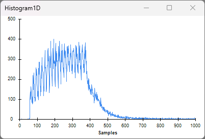
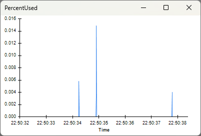
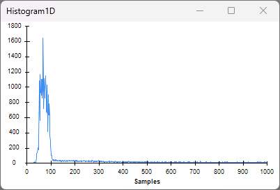

This tutorial shows how to tune <xref:OpenEphys.Onix1.StartAcquisition>'s
<xref:OpenEphys.Onix1.StartAcquisition.ReadSize> property to avoid buffer overflow errors which
prematurely terminates the acquisition session and minimize latency of data transfer between the
ONIX system and the computer for low-latency closed-loop feedback.  

## ONIX Hardware Buffer and ReadSize

An important concept for understanding the effect of ReadSize is the hardware buffer. The hardware
buffer is a temporary storage area that facilitates data transfer between the ONIX system and the
PC. When the hardware buffer accumulates an amount of data that exceeds a threshold, this chunk of
data is read by the PC and removed from the buffer. This threshold is determined by the value of
ReadSize, a property of the StartAcquisition operator which is necessary for every workflow that
uses <xref:OpenEphys.Onix1> to acquire data from ONIX.

### ReadSize Tradeoffs

There are two primary tradeoffs when selecting the optimal ReadSize value: latency and risk of
hardware buffer overflow. Let's take at look at how those are affected by tuning ReadSize lower or
higher for a given data rate.

As ReadSize decreases, less data in the buffer is required for the computer to be able to read from
the buffer. This means less time would need to pass before having access to that data. Therefore,
setting ReadSize lower provides lower latency data (i.e. allows access to data closer in time to the
physical creation of that data). However, there is a limit to this. Each call to the function that
reads data from the hardware buffer requires resources from the computer (i.e. memory and CPU
cycles). If ReadSize is too low such that the read function is being called in succession too
rapidly, your computer won't be able to keep up with the amount of read function calls required to
read all the data from the buffer. This can lead to an over-accumulation of data in the hardware
buffer and an error when the buffer reaches maximum capacity that terminates the acquisition
session. 

As ReadSize increases, more data in the buffer is required for the computer to be able to read from
the buffer. This means more time would need to pass before having access to that data. Therefore,
setting ReadSize higher reduces the frequency of calls to the read function thereby reducing the
risk that your computer is overwhelmed by the amount of read functions calls required to clear the
buffer. As you might have surmised already, this increases the latency between the creation of data
and the retrieval of that data by your computer. 

## Tuning ReadSize

### Setup

Follow the [Getting Started](xref:getting-started) guide to set up your Bonsai environment and
familiarize yourself with using OpenEphys.Onix1 to acquire data from ONIX. Copy the following
workflow into the Bonsai workflow editor by hovering over workflow image and clicking on the
clipboard icon that appears.

::: workflow 
 
:::

Open Bonsai and paste this workflow by clicking the Bonsai workflow editor pane and hitting
<kbd>Ctrl+V</kbd>.

### Workflow Description

::: workflow 
 
:::

The top-level configuration chain includes a <xref:OpenEphys.Onix1.ConfigureLoadTester>. The load
tester device allows us to emulate different rates of data production and measure latency between
data reads and data writes. For example, enabling two Neuropixels 2.0 probes will produce about 47
MB/s ≈((8\*2+384\*2)\*30000\*2)/1e6. In this example, we'll use `ConfigureLoadTester` to emulate
this payload. To do so, `ConfigureLoadTester`'s ReceivedWords and FramesPerSecond are respectively
392 and 60,000. This parallels the rate of data being produced by two probes: 1
<xref:OpenEphys.Onix1.NeuropixelsV2eDataFrame> at 60 kHz. The Enable property is set to True to
enable the LoadTester device. Its DeviceName is set to "Load Tester" so that it has a
straightforward name to use to link the <xref:OpenEphys.Onix1.LoadTesterData> and
<xref:OpenEphys.Onix1.LoadTesterLoopback> operators. The DeviceAddress property is set to 11 because
that's how this device is indexed in the ONIX system. 
<!-- TransmittedWords property -->

All of the <xref:OpenEphys.Onix1.ConfigureBreakoutBoard>'s devices except the MemoryMonitor are
disabled. 

<xref:OpenEphys.Onix1.StartAcquisition>'s <xref:OpenEphys.Onix1.StartAcquisition.WriteSize> is set
to 16384. This defines a readily-available pool of memory for the creation of output data frames. A
larger size will reduce the frequency of dynamic memory allocation system calls but increase the
expense of each of those calls. The effect on real-time performance is typically not as large as
that of the ReadSize property because it does not determine when they are written to hardware. Data
is written to hardware as soon as an output frame has been created. In contrast, data is read from
hardware whenever more than ReadSize bytes have accumulated in the input buffer. The ReadSize
property is also set to 16384. We'll take a closer look at and play with that value in the next
section.

::: workflow 
 
:::

LoadTesterData produces a sequence of
[LoadTesterDataFrames](xref:OpenEphys.Onix1.LoadTesterDataFrame). The
<xref:OpenEphys.Onix1.DataFrame.HubClock> member and the
<xref:OpenEphys.Onix1.LoadTesterDataFrame.HubClockDelta> member are each selected from the
LoadTesterDataFrame with their own <xref:Bonsai.Expressions.MemberSelectorBuilder>.

The HubClock member indicates the value of the hub's clock when that LoadTesterDataFrame was
produced. A hub is a piece of hardware that coordinates a group of devices e.g. the breakout board
is a hub that coordinates DigitalInput, DigitalOutput, AnalogIO, Memory Monitor, etc.. EveryNth is a
<xref:Bonsai.Reactive.Condition> which only allows through every Nth element in the observable
sequence. You can inspect its logic by double-clicking the node when the workflow is not running. In
this case, the N property is set to 100, so every 100th sample is allowed through the EveryNth
operator and sent to LoadTesterLoopback. This operator is a *sink* operator which writes the
HubClock member that was passed through the EveryNth operator back to the load tester device. The
load tester device will then update the HubClockDelta members in all subsequent
LoadTesterDataFrames. 
<!-- why is everyNth necessary? -->

The HubClockDelta member indicates the difference between the HubClock value sent to the
LoadTesterLoopback operator and the load tester's hub clock value when that HubClock value was
received by the hardware. <xref:Bonsai.Reactive.DistinctUntilChanged> filters out repeated elements
which is necessary because HubClockDelta only ends up getting updated every 100th
LoadTesterDataFrame. The next operator <xref:Bonsai.Scripting.Expressions.ExpressionTransform>
converts the HubClockDelta from units of Hub clock cycles to units of microseconds. This data gets
sent to <xref:Bonsai.Dsp.Histogram1D> to help visualize the distribution of closed-loop latencies.

::: workflow 
 
:::

To learn about the <xref:OpenEphys.Onix1.MemoryMonitorData> branch, visit the [Breakout Board Memory
Monitor](xref:breakout_memory-monitor) (or the equivalent for any of our other hardware) page.

### Measuring Latency at Different ReadSize Values

#### ReadSize = 16384

With ReadSize set to 16384, start the workflow, and [open the visualizers](xref:visualize-data) for
the PercentUsed and Histogram1D nodes:

 
 

Average latency appears to be about 300 μs (in this plot, 1000 corresponds to 1 ms). This
approximately comports with expectations. If data is being produced at about 47MB/s, it takes about
348 μs to accumulate 16384 bytes. This isn't a perfect estimate because there are other devices
producing data (e.g. the Memory Monitor and Heartbeat) though the data rate of those devices is
completely dwarfed by the data rate of pay load tester. The most likely source of this discrepancy
is that the computer is not 100% available to perform the read operation. This causes some reads to
be delayed and some reads to happen sooner. This calculation that leads to a 348 μs latency can be a
first order estimate of latency to determine an optimal ReadSize, but it's not perfect. The PayLoad
tester provides empirical measurements of latency and memory usage.

The hardware buffer also doesn't seem to be over-accumulating data i.e. the MemoryMonitor
PercentUsed visualizer shows that the percentage of the buffer being used remains close to zero. 

For many experiments, the above latency is totally acceptable. In any case, let's see how much lower
we can get the latency for more intense closed-loop experiments. 

#### ReadSize = 2048

Set ReadSize to 2048 and restart the workflow (ReadSize is a 
[<button class="badge oe-badge-border oe-badge-yellow" data-bs-toggle="tooltip" title="Configuration properties have an effect on hardware when a workflow is started and are used to initialize the hardware state. If they are changed while a workflow is running, they will not have an effect until the workflow is restarted."> Configuration</button>](xref:OpenEphys.Onix1#configuration)
property so it only updates when a workflow starts), and open the same visualizers: 

 
 

The closed-loop latencies now average about 80 μs. The hardware buffer still seems pretty stable
around zero even after letting some time pass. Let's see if we can decrease latency even further
without overflowing the buffer.

#### ReadSize = 1024

Set ReadSize to 1024, restart the workflow, and open the same visualizers.

 
 

The Histogram1D visualizer appears to be empty. This is because the latency immediately exceeds the
upper limit x-axis of 1 ms. You can see this by inspecting the visualizer for the node prior to
Histogram1D. Because the computer cannot keep up with the amount of read operations necessary to
clear the buffer, there is a bunch of data in the queue that needs to be read before the most recent
data frames are accessible. Therefore, by the time a particular data frame gets read from the
buffer, a bunch of time has already passed since that frame was generated. This means it takes
longer for a given HubClock value to reach the LoadTesterLoopBack operator which subsequently means
increased latencies.

Because the amount of data in the hardware buffer is rising (which can be seen by looking at the
MemoryMonitor PercentUsed visualizer), the acquisition session will eventually terminate in an error
when the MemoryMonitor PercentUsed reaches 100% and the hardware buffer overflows.

> [!NOTE]
> The point at which your computer will not be able to keep up with with the number of reads to keep
> the buffer clear as demonstrated here depends on your computer's capabilities and might be
> different from when our computer can no longer do that. The computer used to create this tutorial
> has the following specs:
> - CPU: Intel i9-12900K
> - RAM: 64 GB
> - GPU: NVIDIA GTX 1070 8GB
> - OS: Windows 11

#### Summary

The results of our experimentation are as follows:

| ReadSize | Latency              | Buffer Usage    | Notes                                                                                              |
|----------|----------------------|-----------------|----------------------------------------------------------------------------------------------------|
| 16384    | ~300 μs              | Stable at 0%    | Perfectly fine if there aren't any strict low latency requirements, lowest risk of buffer overflow |
| 2048     | ~80 μs               | Stable near 0%  | Balances latency requirements with low risk of buffer overflow                                     |
| 1024     | Rises steadily       | Rises untenably | Certain buffer overflow error                                                                      |

These results may differ for your experimental system. For example, your system might have different
bandwidth requirements (if you are using different devices, data is produced at a different rate) or
use a computer with different performance capabilities (which changes how quickly it can perform
read operations).

<!-- ## Tuning ReadSize with Real-Time Processing -->