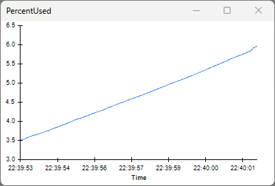

This tutorial shows how to optimize the
<xref:OpenEphys.Onix1.StartAcquisition>'s
<xref:OpenEphys.Onix1.StartAcquisition.ReadSize> property for your specific data
acquisition setup to minimize delays between data collection and computer
processing. This tutorial provide a method to tune `ReadSize` within the context
of your particular data sources and computer specifications in order to achieve
the fastest possible response times for closed-loop experiments. In most
situations, sub-200 microsecond closed-loop response times can be achieved.

> [!NOTE]
> Performance will vary based on your computer's capabilities and your results
> might differ those presented below. The computer used to create this tutorial
> has the following specs:
> - CPU: Intel i9-12900K
> - RAM: 64 GB
> - GPU: NVIDIA GTX 1070 8GB
> - OS: Windows 11

## Hardware Buffer and ReadSize

The ONIX **Hardware Buffer** consists of 2GB of dedicated RAM
that belongs to the acquisition hardware (it is _not_ RAM in the host computer).
The hardware buffer temporarily stores data that has not yet been transferred to
the host. When the host software is consuming data optimally, the hardware
buffer is bypassed entirely and data flows directly from production to the
host RAM, minimizing the latency between data collection and processing.

Each time the host software reads data from the hardware, it obtains
**ReadSize** bytes of data  using the following procedure:

1. A block of memory that is `ReadSize` bytes long is allocated by the API
2. A pointer to that memory is provided to the kernel driver, which locks it
   into kernel mode and initiates a [DMA
   transfer](https://en.wikipedia.org/wiki/Direct_memory_access) from the
   hardware.
3. The transfer is performed by the ONIX hardware without CPU intervention and
   completes once `ReadSize` bytes have been produced.
4. Upon transfer completion, the buffer is passed back to user mode and the API
   function returns with a pointer to the filled buffer.

There are a couple of things to note about this process:

1. Memory is allocated only once by the API, and the transfer is
   [zero-copy](https://en.wikipedia.org/wiki/Zero-copy). ONIX hardware writes
   directly into the API-allocated buffer autonomously without using the host
   computer's resources. Within this process, `ReadSize` determines the amount
   of data that is transferred each time the API reads data from the hardware.
2. If the buffer is allocated and the transfer initiated by the host API before
   data is produced by the hardware, the data is transferred directly into the
   buffer and completely bypasses the Hardware Buffer. In this case, hardware is
   literally streaming data to the software buffer _the moment it is produced_.
   It is physically impossible to achieve lower latencies than this situation.
   The goal of this tutorial is to allow your system to operate in this regime.

The size of hardware to host data transfers is determined by the
<xref:OpenEphys.Onix1.StartAcquisition.ReadSize> property of the
StartAcquisition operator, which is necessary for every workflow that uses
<xref:OpenEphys.Onix1> to acquire data from ONIX. Choosing an optimal `ReadSize`
value balances the tradeoff between latency and overall bandwidth. Smaller
`ReadSize` values mean that less data needs to accumulate before the kernel
driver relinquishes control of the buffer to software. This, in effect, means
less time needs to pass before software can start operating on data, and thus
lower-latency feedback loops can be achieved. However, because each transfer
requires calls to the kernel driver, they incur significant overhead. If
`ReadSize` is so low that the average time it takes to perform a data transfer
is longer than the time it takes the hardware to produce data, data will
accumulate in the Hardware Buffer. This will destroy real-time performance and
eventually cause the hardware buffer to overflow, terminating acquisition.

## Tuning ReadSize to Optimize Closed Loop Performance
ONIX provides a mechanism for tuning the value of `ReadSize` to optimize closed
loop performance that takes into account the indosycncracies of your host
computer and experimental acquisition setup.

> [!NOTE]
> If you are not familiar with the basic usage of the `OpenEphys.Onix1` library,
> then visit the [Getting Started](xref:getting-started) guide to set up your
> Bonsai environment and familiarize yourself with using the library to acquire
> data from ONIX before proceeding.

Copy the following workflow into the Bonsai workflow editor by hovering over
workflow image and clicking on the clipboard icon that appears. Open Bonsai and
paste this workflow by clicking the Bonsai workflow editor pane and hitting
<kbd>Ctrl+V</kbd>.

::: workflow

:::

### Hardware Configuration
The top-row configuration chain includes a
<xref:OpenEphys.Onix1.ConfigureLoadTester> operator. This configures ONIX's Load
Tester Device, which produces and consumes data at user specified rates for
testing and tuning the latency between data production and real-time feedback.
This device is _not a emulator_. It is a real hardware device that produces and
consumes data using the selected driver and physical link (e.g. PCIe bus) and
thus provides accurate measurements of feedback performance for a given host
computer.

::: workflow

:::

We need to configure the load tester to produce and consume the same amount of
data as our real experimental hardware would. For example, lets say that during
our closed loop experiment, feedback signals will be generated as a function of
data acquired from two Neuropixels 2.0 probes, each of which generates a 384
channel sample at 30 kHz. The overall bandwidth is

$$
\begin{equation}
  2\,probes*\frac{384\,chan.}{probe}*\frac{30\,ksamp.}{sec\,chan.}*\frac{2\,bytes}{samp.} \approx 47\,MB/s
  \label{eq:2xnpx2bw}
\end{equation}
$$

We'll setup `ConfigureLoadTester` to produce data at the same frequency and
bandwidth as two Neuropixels 2.0 probes with the following settings:

- `DeviceAddress` is set to 11 because that's how this device is indexed in the
  ONIX system.
- `DeviceName` is set to "LoadTester"
- `Enable`is set to True to enable the LoadTester device.
- `FramesPerSecond` is then set to 60,000 Hz. The rate at which frames are
  produced by two probes.
- `ReceivedWords` is set to 392 bytes, the size of a single
  <xref:OpenEphys.Onix1.NeuropixelsV2eDataFrame>.
- `TransmittedWords` is set to 100 bytes. This simulates the amount of data
  required to e.g. send a stimulus waveform.

> [!NOTE]
> The `DeviceAddress` must be manually configured because
> <xref:OpenEphys.Onix1.ConfigureLoadTester> is used for diagnostics and testing
> and therefore is not made available through
> <xref:OpenEphys.Onix1.ConfigureBreakoutBoard> like the rest of the local
> devices (analog IO, digital IO, etc.)

Next we configure <xref:OpenEphys.Onix1.StartAcquisition>'s
<xref:OpenEphys.Onix1.StartAcquisition.ReadSize>
<xref:OpenEphys.Onix1.StartAcquisition.WriteSize> properties. `WriteSize` is set
to 16384 bytes. This defines a readily-available pool of memory for the creation
of output data frames. A larger size will reduce the frequency of dynamic memory
allocation system calls but increase the expense of each of those calls. The
effect on real-time performance is typically not as large as that of the
`ReadSize` property because it does not determine when data is written to
hardware. Data is written to hardware as soon as an output frame has been
created. To start, we also set the `ReadSize` property is also set to 16384. In
the next section, we'll examine the effect of this value on real time
performance.

### Real-time Loop
The bottom half of the workflow is used to stream data back to the load testing
device from hardware so that it can perform a measurement of round trip latency.
The <xref:OpenEphys.Onix1.LoadTesterData> operator acquires a sequence of
[LoadTesterDataFrames](xref:OpenEphys.Onix1.LoadTesterDataFrame) from the
hardware each of which is split into its
<xref:OpenEphys.Onix1.DataFrame.HubClock> member and
<xref:OpenEphys.Onix1.LoadTesterDataFrame.HubClockDelta> member.

::: workflow

:::

The `HubClock` member indicates the acquisition clock count when the
`LoadTesterDataFrame` was produced. The `EveryNth` operator is a
<xref:Bonsai.Reactive.Condition> which only allows through every Nth element in
the observable sequence. This is used to simulate an algorithm, such as spike
detection, that only triggers closed loop feedback in response to input data
meeting some condition. The value of `N` can be changed to simulate different
feedback frequencies. You can inspect its logic by double-clicking the node when
the workflow is not running. In this case, `N` is set to 100, so every 100th
sample is sent to <xref:OpenEphys.Onix1.LoadTesterLoopback> operator.

`LoadTesterLoopback` a *sink* which writes the HubClock member that was passed
through the EveryNth operator back to the load tester device. When this value is
received in the hardware its subtracted from the current acquisition clock count
value and is sent with the `HubClockDelta` value of subsequent
`LoadTesterDataFrames`. Therefore, `HubClockDelta` indicates the amount of time
that has passed since the creation of it frame in hardware and the receipt of a
feedback signal in hardware based on that frame: it is a complete measurement of
closed loop latency. This value is converted to milliseconds and then
<xref:Bonsai.Dsp.Histogram1D> is used to to help visualize the distribution of
closed-loop latencies.

Finally, at the bottom of the workflow, a
<xref:OpenEphys.Onix1.MemoryMonitorData> operator is used to examine the state
of the hardware buffer. To learn about the
<xref:OpenEphys.Onix1.MemoryMonitorData> branch, visit the [Breakout Board
Memory Monitor](xref:breakout_memory-monitor) (or the equivalent for any of our
other hardware) page.

::: workflow

:::

### Real-time Latency for Different ReadSize Values

#### ReadSize = 16384 bytes
With `ReadSize` set to 16384 bytes, start the workflow, and
[open the visualizers](xref:visualize-data) for the PercentUsed and Histogram1D
nodes:

Data is produced at about 47MB/s. Therefore it takes about 340 μs to accumulate
16384 bytes. This means that the _oldest data_ in the buffer is from 350 μs in
the past. Because we are using only every `N`th sample to generate feedback, the
sample that is actually used to trigger an output could be more recent than this
resulting in a latency lower then 350 us. Indeed, we see the average latency in
the histogram is ~300 μs (in this plot, 1000 corresponds to 1 ms). and can be as
low as ~60 μs. The long tail in the distribution corresponds to instances when
the hardware buffer was used or the operating system was busy with other tasks.

With `ReadSize` of 16384 bytes, the PercentUsed Visualizer shows that the
percent of RAM in the Hardware Buffer being used remains close to zero. This
indicates that the Hardware Buffer is generally being bypassed because data is
being read more quickly by the host than it is produced by the hardware. For
many experiments, the above latency is more than acceptable. In any case, let's
see how much lower we can get the latency for more extreme closed-loop
experiments.

#### ReadSize = 16384 bytes
Set `ReadSize` to 2048 bytes and restart the workflow (ReadSize is a
[<button class="badge oe-badge-border oe-badge-yellow" data-bs-toggle="tooltip" title="Configuration properties have an effect on hardware when a workflow is started and are used to initialize the hardware state. If they are changed while a workflow is running, they will not have an effect until the workflow is restarted."> Configuration</button>](xref:OpenEphys.Onix1#configuration)
property so it only updates when a workflow starts), and open the same visualizers:

The closed-loop latencies now average about 80 μs. The hardware buffer is still
stable at around around zero indicating that, even given the increased overhead
associated with a smaller `ReadSize`, software is collecting data rapdily enough
to prevent accumlation in the hardware buffer. Let's see if we can decrease
latency even further.

#### ReadSize = 1024

Set `ReadSize` to 1024 bytes, restart the workflow, and open the same visualizers.

The Histogram1D visualizer appears to be empty. This is because the latency
immediately exceeds the upper limit x-axis of 1 ms. You can see this by
inspecting the visualizer for the node prior to Histogram1D. Because of the very
small buffer size, which corresponds to approximately a single Neuropixel 2.0
sample, the computer cannot perform read operations at a rate required to keep
up with data production. Therefore data accumulates in the hardware buffer. By
the time a particular data frame gets read from the buffer, a bunch of time has
already passed since that frame was generated, latencies are increased
dramatically, and closed loop performance collapses.

Because the amount of data in the hardware buffer is rising (which can be seen
by looking at the MemoryMonitor PercentUsed visualizer), the acquisition session
will eventually terminate in an error when the MemoryMonitor PercentUsed reaches
100% and the hardware buffer overflows.

#### Summary

The results of our experimentation are as follows:

| ReadSize      | Latency              | Buffer Usage    | Notes                                                                                              |
|---------------|----------------------|-----------------|----------------------------------------------------------------------------------------------------|
| 16384 bytes   | ~300 μs              | Stable at 0%    | Perfectly fine if there aren't any strict low latency requirements, lowest risk of buffer overflow |
| 2048 bytes    | ~80 μs               | Stable near 0%  | Balances latency requirements with low risk of buffer overflow                                     |
| 1024 bytes    | Rises steadily       | Unstable        | Certain buffer overflow and terrible closed loop performance                                       |

These results may differ for your experimental system. For example, your system
might have different bandwidth requirements (if you are using different devices,
data is produced at a different rate) or use a computer with different
performance capabilities (which changes how quickly it can perform read
operations). Additionally, in this tutorial, there was minimal computational
load imposed by the workflow itself. In most applications, some interesting
processing must be performed on the data in order for a feedback signal to be
generated. Its important to take this into account when tuning your system and
potentially modify the workflow to perform computations on incoming data in
order to account for the effect of computational demand on closed loop
performance.

<!-- ## Tuning ReadSize with Real-Time Processing -->