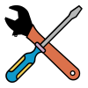

`OpenEphys.Onix1` is a [Bonsai](https://bonsai-rx.org/) library for the [ONIX
PCIe Acquisition System](https://open-ephys.org/onix/oeps-9006). It supports:

- [Neuropixels (all variants)](https://www.neuropixels.org/),
  [Miniscopes](https://open-ephys.org/miniscope-v4/miniscope-v4), [Intan-based
  headstages](https://open-ephys.org/onix/oeps-7741), and more.
- Automatic hardware synchronization across all data streams.
- Torque-free commutation of ultra-thin (down to ~0.2 mm diameter) tethers.
- High-performance closed-loop feedback (~100 µs loop times).

 

| [User Guide](xref:getting-started) | [Operator Reference](xref:OpenEphys.Onix1) | <xref:tutorials> | [Hardware Guide](https://open-ephys.github.io/onix-docs/) |
|:----:|:----:|:----:|:----:|
| [{width=150}](xref:getting-started) | [{width=150}](xref:OpenEphys.Onix1) | [{width=150}](xref:tutorials) |[{width=150}](https://open-ephys.github.io/onix-docs/)|
| Start here for usage instructions. | Detailed information on library components. | How to make the most of ONIX in Bonsai. | Go to the hardware documentation site. |

 

Bonsai is built on [Reactive Extensions](https://reactivex.io/) (Rx), which
models every data source as an observable sequence of
events. This fits ONIX recordings naturally: a Neuropixels probe, a Miniscope
camera, and a behavioral controller each run at different rates and produce data
asynchronously, and Rx lets you combine, filter, and react to those streams
without writing any threading or buffering code. All ONIX streams share a common
hardware clock, so alignment across devices is automatic. For closed-loop
experiments, the same reactive model lets you compose stimulus delivery directly
from incoming data, with loop times around 100 µs.

Bonsai is actively developed and maintained as an open-source project, with a
growing community of neuroscience labs and an expanding package ecosystem.
`OpenEphys.Onix1` can be used alongside:

- The Open Ephys [acquisition system](https://open-ephys.org/acquisition-system)
- [Arduino boards](https://github.com/bonsai-rx/arduino)
- [National Instruments](https://bonsai-rx.org/daqmx/articles/intro.html) DAQ boards
- Machine-vision cameras ([Flir](https://github.com/bonsai-rx/spinnaker),
  [Basler](https://github.com/bonsai-rx/pylon),
  [Allied Vision](https://github.com/bonsai-rx/vimba),
  [Ximea](https://github.com/bonsai-rx/ximea), and more)
- [Harp](https://harp-tech.org/index.html) behavioral devices
- [Sanworks Bpod](https://sanworks.github.io/Bpod_Wiki/)
- Pose estimation via [DeepLabCut](https://github.com/bonsai-rx/deeplabcut) and
  [SLEAP](https://github.com/bonsai-rx/sleap)
- The [UCLA Miniscope ecosystem](https://open-ephys.github.io/miniscope-docs/index.html)

> [!NOTE]
> ONIX can also be used with the [Open Ephys
> GUI](https://open-ephys.github.io/gui-docs/) via the [ONIX Source
> plugin](https://open-ephys.github.io/gui-docs/User-Manual/Plugins/Onix-Source.html),
> though it covers [a subset of ONIX
> features](https://open-ephys.github.io/gui-docs/User-Manual/Plugins/Onix-Source.html#onix-support)
> compared to `OpenEphys.Onix1`. See the [software
> comparison](https://open-ephys.github.io/onix-docs/Software%20Guide/index.html#software-comparison)
> for details.
